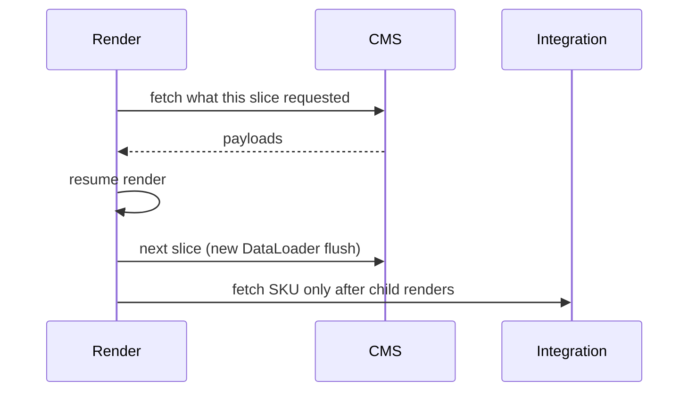
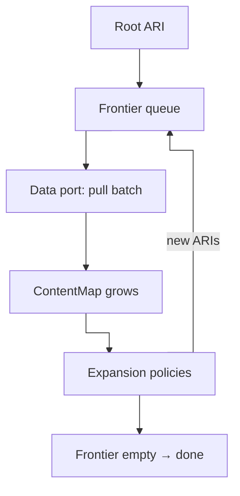

Over the last three years I had the chance to work on two large institutional websites. Same broad shape in both cases:

- a headless CMS (Contentful)
- an **integration layer** beside the CMS (product catalog, commercial data, news…)
- **web pages** assembled from CMS modules - like hero, carousel, tabs, and so on - each module mapping to a content type
- content localized across **roughly thirty locales**

Different brands, different teams, similar constraints. And in both projects, a naive approach to data loading stopped being credible long before the sites felt "finished".

This experience is what led to [`@xndrjs/resource-graph-resolver`](/v0/infrastructure/resource-graph-resolver/). This article walks through the kinds of problems that show up in products of this shape and scale, what I realized I needed, and how I chose to separate layers instead of pushing complexity into Next.js.

The central question is: **how much of this can we abstract**, so the next similar project does not reinvent the wheel? How do we avoid a totally custom data-loading system — one that scales with complexity and can evolve with the product lifecycle — instead of a tangle of `if`s and special rules scattered across the codebase?

---

## The naive mental model (and why it feels obvious)

Picture a **Next.js** app with SSR. A route resolves to a `pageId`, typically via a path-resolution step ("this pathname resolves to this page id"). You load the **top-level modules** attached to that page, for instance a hero, a carousel, some tabs and so on.

Control passes to React server components: one component per module type. Modules that embed other modules: that's where the **tabs** block referencing product strips, promos, o other editorial content calls a recursive render for its children.

The fetch strategy that almost suggests itself: **each module loads whatever it needs, when it renders**.

It mirrors how the UI is structured and it keeps concerns local. Why not? TypeScript and colocation make it feel disciplined. If you've built CMS-driven sites, you've probably been there — or watched a team be there on day one.

On paper, GraphQL is the other obvious escape hatch: "one query, nested fragments, polymorphism where needed, done". The frontend stays declarative; the server returns a shaped tree.

For a brochure site with shallow pages and a handful of locales, that can hold.

For the projects I'm describing, it didn't.

---

## Problem #1: N+1 at CMS scale

Recursive server components that fetch on render produce classic **N+1** patterns.

A page resolves its modules. A tabs module resolves _its_ modules. Each leaf may trigger another HTTP request. Depth multiplies calls. Shared references (same asset, same product teaser appearing in two tabs) may be fetched twice unless something deduplicates globally.

On one project this stopped being a tuning issue and became a **throughput** issue. The CMS was the bottleneck. Not because Contentful is slow — because we were asking it hundreds of times per page in the worst paths.

Batch endpoints help only if something **orchestrates** the batch up front. Component-local fetching doesn't naturally batch across sibling subtrees unless you bolt on a cache layer as an afterthought.

---

## Problem #2: fetch and render take turns

Component-driven loading is **fetch and render alternating in waves**.

Each component `await`s, then more of the tree renders, then another fetch. By default, DataLoader batches within a single flush. Interleaving render with fetch **shrinks those windows** to whatever the current slice of the tree happened to request.

Interleaving render and fetch means many `load()` calls start **after** a batch has already fired — from other parts of the tree. Even with a wider schedule, `Promise.all` and DataLoader do not see siblings that have not run yet.



---

## Problem #3: GraphQL resolves in depth — until complexity says "stop"

GraphQL looks like the fix after component fetch: **one query, nested fragments, shaped tree**. The naive mapping from UI to GraphQL is familiar:

```graphql
... on HeroModule {
  ...HeroModuleData
}
... on TabsModule {
  ...TabsModuleData
}
... on ProductStripModule {
  ...ProductStripModuleData
}
# one inline fragment per module/content-type the composer can handle
```

Each module type owns a fragment. When a `tabs` entry can point at many different module types, GraphQL models those children as a union, and if you want to resolve specific data for each module type, the query must list an inline fragment (`... on HeroModule`, `... on ProductStripModule`, …) for every type the composer allows.

At first it reads cleanly, but on a large space (**200+ content types** is possible on long-lived institutional builds), you hit a fork with no good branch:

| Approach                                                                         | What breaks                                                                                                                                                                                                                                                                                                                        |
| -------------------------------------------------------------------------------- | ---------------------------------------------------------------------------------------------------------------------------------------------------------------------------------------------------------------------------------------------------------------------------------------------------------------------------------- |
| **One query** carrying every module fragment the page composer might ever embed  | **Query too big** — the document must account for the whole polymorphic composer surface (hundreds of inline fragments or equivalent), not just the twenty or thirty types on _this_ page. Payload size, selection breadth, and Contentful's **complexity score** blow up long before your mental model of "page depth" does       |
| **Split queries** per content-type family                                        | Operations and documents **scale with how many content types your composer must handle**. You multiply CMS round-trips, rate limits bite, even **twenty or thirty types on one page** is painful                                                                                                                                   |
| **Dynamically merge** a query from the content types present on _this_ page only | Better on paper; you still assemble large polymorphic selections at runtime, and **query complexity** failures remain frequent and unpredictable. You must implement retry logic by progressively splitting "too complex" sub-queries. So you risk ending up with many wasted round-trips which contribute to reaching rate limit. |

GraphQL **does** resolve in depth — but depth is **strongly capped by complexity**. The API enforces a budget on nested linked entries and field fan-out. Your page composer wants the full nested tree — and editors compose arbitrarily deep structures that keep pushing past that budget.

So GraphQL is not "wrong" by default. What is wrong is assuming a **single query** can serve the whole page — or that a naive split (one query per content type) stays scalable and performant. You need a **content resolution strategy** that faces the real problem: you are resolving a **complex graph**. That is not a framework, library, or vendor problem. It is a **design and orchestration** problem.

---

## Problem #4: Integration orchestration trapped in the frontend

Both sites needed **CMS content to drive integration calls**. A product module stores a SKU or a reference key in Contentful; the sellable price, stock, or eligibility lives in another system.

The naive approach wires that in React/Next:

- server component renders
- reads CMS fields
- calls the integration API
- merges in the component (or in a colocated function)

That works in a single SSR app — until you need the **same resolution** elsewhere:

- a backend job generating previews or exports
- a second consumer on the same domain (i.e. an admin tool)
- a migration from Next.js to some other framework

If orchestration lives in components, every new runtime **reimplements the walk**. The integration layer isn't "beside" the CMS in architecture terms — it's beside the **React tree**. That's the wrong boundary.

We wanted **data resolution independent of the UI framework**. The view should receive a resolved aggregate — not own the graph walk.

---

## Problem #5: rate limits vs. data volume

Contentful rate limits are real. So is Contentful's own CDN cache.

In theory you should rarely hit limits... in practice, **thirty locales**, deep pages, preview vs. delivery, and uncached private paths add up. Multiply by N+1 component fetching and by environments (preview vs delivery, development vs staging vs production). Limits become a **design constraint**, not a remote possibility.

Obvious mitigations:

- aggressive HTTP caching
- copying "everything" into Redis

Each is not optimal for different reasons:

- **Full CMS mirrors** in Redis — entry by entry, asset by asset — drift from editorial truth and need per-content-type invalidation. Worse: the FE or BFF stops **querying the CMS** for linked entries, batch filters, and locale-scoped fetches; it assembles pages by running ad hoc lookups against Redis instead. You reimplement query semantics the CMS already owns. You are operating a brittle "second CMS".
- **Fragmented caches** (per fetch key, per component) never materialize "the page" as one unit. An editorial change may touch dozens of HTTP keys — different TTLs, shared modules reused across routes, no dependency map from entry → page. "Invalidate this page" becomes a forensic exercise: guess which requests to purge, or over-invalidate and lose the benefit of caching. And while components own the "fetch walk" that _assembles_ the page, there is no simple, single entry point to **warm the page cache** from a backend job — short of hitting the frontend itself.

What we wanted sounded simpler and harder than all of this at the same time: "give me **all contents for this page** — atomically, as one resolved unit — while **queries still hit the CMS** (and the integration layer) for fresh data — not a Redis reimplementation of the same work."

Redis can stay as a **cache** layer; it must not become a **second CMS**. We want cache granularity that lets us invalidate **all contents of page X** quickly and without headaches.

That implies a **resolution engine** that knows the graph, batches coherently, and emits **named slices** you can cache with explicit dependency — not ad hoc keys scattered through the component tree.

---

## Problem #6: the infrastructure WILL change

Institutional sites live for years. The stack **will** move:

- CMS vendor (i.e. Contentful today; something else tomorrow)
- integration APIs replaced or split
- data that today comes from a commercial API, tomorrow stored in CMS — or the opposite
- new consumers (i.e. a native app) on the same domain model

If resolution logic is coupled to a specific frontend framework (i.e. Next), a specific transport shape (i.e. GraphQL documents), a specific split of data across services, and so on, the domain becomes increasingly defined by infrastructure concerns. The whole codebase gets filled with low-level detail you will struggle with. The application ends up "serving the infrastructure" — instead of the other way around.

Good architecture here means **deferring implementation detail**: stable identifiers for resources, ports for expansion and loading, orchestration that doesn't live within React/Next.js API.

That's the same instinct as elsewhere in `xndrjs` — [Application Resource Identifiers](/v0/application/application-resources/) for _what_ you're resolving, [transport-aware CMS schemas](/v0/infrastructure/contentful-to-zod/) for _what arrived on the wire_ — but applied to **graph resolution**, not single-entry parsing.

---

## "Just use GraphQL" / "Next can handle it" misses the point

Design problems like these often look like **technology picks**: "use GraphQL and resolve everything in one ad hoc query", "use Next's cache — it's built for this!". Those are technology choices. Alone, they do not solve a complex architectural problem. None of them, alone, answers:

- Who **owns the walk** across CMS + integration?
- How do you **batch** and respect **rate limits** under deep polymorphic pages?
- What is the **unit of cache** when a page shares global modules with every other route?
- How do we **swap vendors** without rewriting the orchestration logic?
- How do we **reuse the same page-builder logic** elsewhere — a backend service, a script that finds unreferenced content, and so on?

These are **scalability and boundary** questions. They don't appear on the first sprint. They appear when locales go live, when editors compose deeper pages, when integration joins the party, and when a second app needs the same data.

---

## Where we're heading

You don't improvise your way out of that with a better query or a smarter framework. You **calibrate layers**:

- **App (consumer)** — needs a domain aggregate for a specific use case (show a page).
- **Use case** — calls a port that can compose that specific aggregate.
- **Adapter** — knows which services to hit to fetch the pieces of the aggregate.
- **Loader** — knows a single service (e.g. Contentful REST).

Why not orchestrate those service calls **in the use case**? That would force the core to know how data is split across CMS, integration, and the rest. In this product that split has **no business meaning** — it is an infrastructure concern. Teaching the core to resolve it means leaking low-level details a page builder does not need.

Why not an **intermediate, vendor-agnostic representation** between each service's response and the domain aggregate? That is another mapping — another model that still may not survive an infrastructure change. What we want here is **orchestration in infrastructure**, because it is not business-rule orchestration; it is low-level composition of **one** domain aggregate. At the application layer there is only the choice of **which port** returns the right aggregate.

The frontend framework is a **consumer** — not the place where the graph is discovered.

So what we need at the adapter level is a **content graph resolver**:

- walk from a root [Application Resource Identifier](/v0/application/application-resources/)
- discover children via an **expansion port** — from a resolved resource identifier + payload, decide which resources to fetch next
- load through a **pull-based data port** so adapters can **saturate each backend per round** and keep round-trips low, without vendor batch limits leaking into orchestration
- materialize a typed Content Map (`ContentMap`) ready for domain mapping (and, when you need it, cache-friendly slices of the graph)

That is [`@xndrjs/resource-graph-resolver`](/v0/infrastructure/resource-graph-resolver/). The sections below cover how the walk works, how multiple backends compose behind one gateway, and how resolved data becomes a domain aggregate your UI can trust — without owning the graph.

---

## How the engine resolves a graph

### Application Resource Identifiers — recap and how we use them here

An [Application Resource Identifier](/v0/application/application-resources/) (ARI) names **one logical resource**: a stable `type` (for example `cms.entry`, `cms.asset`, `integration.product`) plus structural **key parts** (page id and locale, SKU for products,etc.).

**Application** here means _a resource belonging to an app_ — not the Clean Architecture "application layer". We might as well talk about "_Addressable_ Resource Identifiers" of a system, at any level:

- **Infrastructure ARIs** know _where_ data lives: `cms.entry`, `cms.asset`, `integration.product`, etc.
  Please note that `type` must be unique across sources. This is low-level orchestration vocabulary, not business meaning.
- **Application-layer ARIs** should stay **vendor- and storage-agnostic** and speak the **language of the business** — "this page aggregate", "this product listing scope", not "this Contentful entry id".

Both are resource identifiers; each respects the constraints and vocabulary of the layer it belongs to: **infrastructure resources** vs **business resources**.

Resolving data from multiple backends means **knowing the infrastructure split** long enough to load and walk the graph — then **mapping into domain models** that do not care whether news came from Contentful or an internal API. That is why the graph resolver works with ARIs that openly distinguish CMS from integration: so **domain can stay blind** to that low-level partition. The engine coordinates loading across sources; the domain layer receives **trusted aggregates** built from infrastructure-level shapes — not vendor entry ids, fetch URLs, or transport payloads.

In the end, an ARI is a **value object** for an **addressable resource**: identity you can pass around, cache on, and compare — while the loading mechanics stay behind adapters.

### The loop

Conceptually the engine repeats four steps until there is nothing left to resolve:

1. **Seed the frontier** with the root ARI (and optionally promote hits from backing resources into the `ContentMap`).
2. **Pull** — adapters load unresolved resources on the current frontier from CMS, integration APIs, and any other registered source.
3. **Expand** — for each newly resolved resource, run **expansion policies** to discover which ARIs must be fetched next.
4. **Enqueue** those ARIs on the frontier and go back to step 2.

When the frontier is empty, every reachable resource has been loaded (or recorded as missing, depending on your error mode of choice). You get a `ContentMap` of payloads keyed by ARI identity — ready for domain mapping, serialization, or cache writes.



### Expansion policies and execution context

Expansion is **not** hard-coded per content type inside the engine. You author **policies** that depend on exactly three inputs:

- the **current resource identifier**;
- the **current resource payload**;
- an **execution context** you define, for example an **A/B test** variant that selects alternative content, the **user's identity or role**, or any other **contextual input** the walk needs.

Policies must not observe siblings or depend on which peers landed in the same batch. That keeps discovery deterministic: changing a loader’s batch size must not change the edges a policy emits for a given node. Rules that depend on siblings or other nodes are **probably business logic**, and should be orchestrated **outside** a single graph-resolution run.

Each expansion policy answers: _given this resolved node, which ARIs should we try to load next?_ A page entry policy might return linked module entries; a product module policy might return an `integration.product` ARI from a SKU field. Policies can mix **CMS**, **integration**, and future sources — the engine only sees ARIs and ports. That is how orchestration stays in the product code, while the engine stays a generic walker.

### When infrastructure moves, policies move — not the engine

News lived in the CMS yesterday; tomorrow it is served by an internal API. You change **one expansion policy** to emit `integration.news` (for example) instead of `cms.entry` for that branch. The walk, frontier loop, and `ContentMap` shape do not care which HTTP client fulfilled a given `type`.

The same applies when a field moves the other way around, when a vendor is replaced, or when a second consumer reuses the walk: you change the **ARIs involved**, not the orchestration logic.

### Why the data port is pull-based

The resolver deliberately splits **walking the graph** from **talking to each backend**. The engine owns **when** the frontier advances and **which resources are still unresolved**. It does **not** own batch sizes, endpoints, or retry policy — those belong in adapters.

Instead it exposes a **pull API** — `take(accept, limit?)` — on each round:

- the engine offers the current frontier;
- each **adapter** accepts the ARIs it knows how to load (i.e. `cmsEntryAri.matches`, `integrationProductAri.matches`, …);
- each adapter sets **`limit`** to fill its backend efficiently this round;
- anything not taken stays on the frontier for a later round after expansion;
- if every `take` in a `process` call is empty, the adapter should return immediately **without IO**.

So adapters **maximize network saturation on their own terms** (batch ids, parallel sources, rate-limit-friendly chunk sizes) while orchestration never imports vendor constants. The engine walks and expands; infrastructure loaders pull what they can handle.

---

## One gateway to load them all

The engine works with **one** data port. In production you rarely have one backend — you have a CMS, one or more integration APIs, maybe a blob store tomorrow. You also **do not know upfront** how many actors will join: a new commercial API, a database, any external data source. A **gateway** that exposes a single shared interface is the necessary abstraction: it composes heterogeneous loaders behind one `DataResolutionPort`, so the engine stays source-agnostic while the product registers or removes adapters as the integration landscape changes.

The product wires that gateway as a thin port that forwards each pull round to every registered loader and merges the results:

```typescript
export function createDemoDataGateway(cms, integration): DataResolutionPort {
  return {
    async process(pull) {
      const [cmsResult, integrationResult] = await Promise.all([
        cms.process(pull),
        integration.process(pull),
      ]);
      return [...cmsResult, ...integrationResult];
    },
  };
}
```

Composition is **barrier-based per wave**: the engine waits for the whole gateway `process` to finish before expanding. Inside that call, loaders may run in parallel, but wall-clock time for the round still tracks the **slowest** backend in the wave — not the sum of sequential CMS-then-integration trips, and not a speculative expand against half-loaded peers.

That barrier walk is one of two schedulers (`BarrierResolveContentGraphEngine`). When source latencies diverge, prefer the **lane walk** (`LaneResolveContentGraphEngine`): pass an ordered `ResourceLoader` chain (each with `accepts` ownership) instead of a gateway. Each loader is a lane with **exactly one** in-flight `process`; different loaders may overlap, and a fast CMS lane can expand and batch again while a slow integration batch is still pending. Graph semantics stay the same — only the scheduler changes. See [Walk strategies](/v0/infrastructure/resource-graph-resolver/#walk-strategies) in the package guide.

Same orchestration shape, same expansion policies — whether two backends or five, barrier or lane. That is the boundary Problem 4 was asking for: resolution logic that is not the React tree and not a single vendor SDK.

---

## From resolved graph to a domain aggregate

Have you ever modeled a page as a **deeply nested object** — modules, tabs, nested modules — only to discover that your **domain model had to bend** to how your infrastructure exposes relations? Flat link stubs, locale-specific field shapes, product data living in another API: the "page" you wanted to reason about and the "page" your infrastructure gives you dramatically diverge.

The split we described here:

1. **Resolve** the infrastructure graph into a `ContentMap` (CMS entries, assets, integration payloads — keyed by ARI).
2. **Map** that map into **domain aggregates** shaped for your product, not for the wire.

You are free to define a `Page` with nested `modules`, polymorphic tab strips, embedded products with price and stock already merged — because the resolver already did the cross-source walk. Mappers read from the `ContentMap` and emit trusted shapes; they do not call HTTP.

For a page-builder product, a **nested aggregate** is not ceremony — it is what makes UI components **stupid** in the good sense. The framework renders, orchestration already finished upstream.

---

## Connecting the toolkit: contentful-to-zod

[`contentful-to-zod`](/v0/infrastructure/contentful-to-zod/) sits at the **adapter** boundary: parse what arrived on the wire before expansion or domain mapping trust it. Generated schemas know each content type's fields; generated **link metadata** tells expansion which references to follow — without hand-maintaining a matrix of 200+ content types.

Default expansion in the [demo app](https://github.com/xndrjs/toolkit/tree/main/apps/resource-graph-resolver-demo) parses the entry, walks `LINK_FIELDS_BY_CONTENT_TYPE`, and emits ARIs for linked entries and assets:

```typescript
const parsed = ContentfulEntrySchemaByContentType[contentTypeId].parse(entry);

const links = collectLinkReferencesFromEntryFields(contentTypeId, parsed.fields);

return { resources: links.map((link) => linkReferenceToAri(link, locale)) };
```

Cross-source rules stay **small overrides** — e.g. a product entry reads a SKU field and adds an `integration.product` ARI instead of stopping at CMS links:

```typescript
const parsed = ProductEntrySchema.parse(entry);
const sku = parsed.fields.sku;
if (sku) {
  return {
    resources: [integrationProductAri({ sku, locale })],
  };
}
```

Transport correctness and graph discovery stay in infrastructure; the engine still only sees ARIs and policies.

---

## Using Islands to partition the Content Graph

Marking `isIsland: true` gives you a **named slice** of membership and dependency edges. You can then cache the menu and footer independently of the rest of the page, keep a longer-lived dependency manifest, and expire one slice without touching the other.

The engine **does not** decide invalidation. Islands partition the graph so _your_ cache adapters have something coherent to key on; they do not automatically purge parents when a child changes, fan out webhooks, or reconcile stale backing maps. That policy stays in infrastructure — where editorial events and product TTLs already live.

When you rebuild a backing map from several cached islands, the same ARI can appear in more than one slice, potentially with different payloads. The library does not pick a winner: reconstituting backing resources requires a conflict callback, so your adapter can compare the two versions, discard the key (reload fresh resources from the data port), keep one island’s copy, or fail the build.

---

## Lessons to be learned

Deep CMS pages across many locales are not a rendering problem. They are a **graph resolution** problem. Treat them that way early — or pay in round-trips, rate limits, and infernal rewrites when the infrastructure moves.

[`@xndrjs/resource-graph-resolver`](/v0/infrastructure/resource-graph-resolver/) is the engine for that walk.

A [demo app](https://github.com/xndrjs/toolkit/tree/main/apps/resource-graph-resolver-demo) in the toolkit repo shows one possible wiring — Contentful-shaped fixtures, an integration catalog, gateway, expansion policies, domain mapping into a Next page. It is intentionally **small**: a workshop, not a production site, and it does **not** exercise the full layer discipline of the [Clean Architecture monorepo template](/blog/clean-architecture-monorepo-template/) (ports _everywhere_, governed boundaries, generators...).

Treat the demo as proof that the same orchestration can run outside React; treat the template as where a real team would harden the seams.

---

## Further reading

- [Resource graph resolver (docs)](/v0/infrastructure/resource-graph-resolver/)
- [Application resources](/v0/application/application-resources/)
- [Contentful to Zod](/v0/infrastructure/contentful-to-zod/)
- [We're Not "Frontend Developers" Anymore](/blog/were-not-frontend-developers-anymore/)
