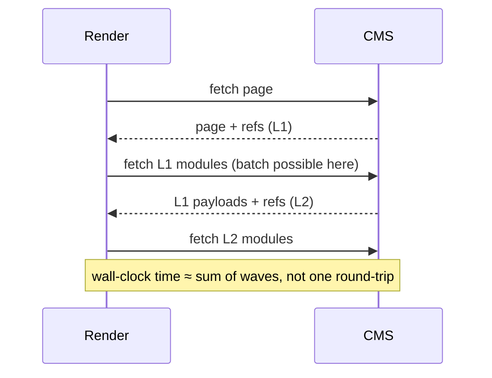
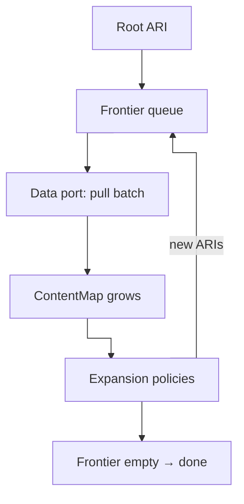

Over the last three years I worked on two large institutional websites. Same broad shape in both cases:

- a headless CMS (Contentful)
- an **integration layer** beside the CMS (product catalog, commercial data, …)
- a **news** section
- **marketing pages** assembled from CMS modules — hero, carousel, tabs, and so on, each module mapping to a content type
- content localized across **roughly thirty locales**

Different brands, different teams, similar constraints. And in both projects, a naive approach to data loading stopped being credible long before the sites felt "finished".

That constraint is what led to [`@xndrjs/resource-graph-resolver`](/v0/infrastructure/resource-graph-resolver/). This article walks through what broke in production-shaped setups, what we actually needed, and how we chose to separate layers instead of pushing complexity into Next.js (or your SSR/SSG framework of choice). We start with the problems; later sections cover the design and the library itself.

---

## The naive mental model (and why it feels obvious)

Picture a **Next.js** app with SSR. A route resolves to a `pageId`. You load the **top-level modules** attached to that page. Control passes to React server components: one component per module type. Modules that embed other modules — a **tabs** block referencing heroes, product strips, promos — call a recursive render helper for their children.

The fetch strategy that almost suggests itself:

> Each module loads whatever it needs, when it renders.

It mirrors how the UI is structured. It keeps concerns local. TypeScript and colocation make it feel disciplined. If you've built CMS-driven sites, you've probably been here — or watched a team arrive there on day one.

On paper, GraphQL is the other obvious escape hatch: "one query, nested fragments, done". The frontend stays declarative; the server returns a shaped tree.

For a brochure site with shallow pages and a handful of locales, that can hold.

For the projects I'm describing, it didn't.

---

## Problem 1: N+1 at CMS scale

Recursive server components that fetch on render produce classic **N+1** patterns — not in the SQL sense, but in the **HTTP round-trip** sense.

A page resolves its modules. A tabs module resolves _its_ modules. Each leaf may trigger another Delivery or CMA call. Depth multiplies calls. Shared references (same asset, same product teaser appearing in two tabs) may be fetched twice unless something deduplicates aggressively.

On one of the two projects this stopped being a tuning issue and became a **throughput** issue. The CMS was the bottleneck. Not because Contentful is slow — because we were asking it hundreds of times per page in the worst paths.

Batch endpoints help only if something **orchestrates** the batch up front. Component-local fetching doesn't naturally batch across sibling subtrees unless you bolt on a cache layer as an afterthought.

---

## Problem 2: fetch and render take turns

Component-driven loading is not "slow fetching". It is **fetch and render alternating in waves**.

A naive SSR tree cannot request what it does not yet know. The page fetch reveals top-level module refs. Only then can tabs request their children. Only then can those children request assets or product links. Each `await` on a CMS call is a **serialization point**: the next batch of ids is discovered only after the previous layer returns.



**DataLoader** (or similar patterns) helps **inside a wave**: same asset requested from menu and footer in the same tick collapses to one call; entry ids collected in one flush become one batched Delivery request.

It does **not** reduce the waves. Keys for depth _n + 1_ are unknown until depth _n_ resolves. Dedup and batching cannot merge across awaits that separate discovery from fetch. Integration calls driven by CMS fields inherit the same staircase: resolve module → read SKU → call commerce API → render.

So the naive model optimizes **colocation and developer ergonomics**, while latency and CMS pressure track **graph depth** — often the very thing your page composer is designed to increase.

---

## Problem 3: GraphQL resolves in depth — until complexity says "stop"

GraphQL (including Contentful's API) looks like the fix after component fetch: **one query, nested fragments, shaped tree**. The naive mapping from UI to GraphQL is familiar:

```graphql
... on HeroModule {
  ...HeroModuleFragment
}
... on TabsModule {
  ...TabsModuleFragment
}
... on ProductStripModule {
  ...ProductStripModuleFragment
}
# one inline fragment per module/content-type the composer can embed
```

Each module type owns a fragment. Polymorphic strips (`tabs` entries pointing at heterogeneous modules) become spreads on a union or interface. It reads cleanly — for a while.

On a large space (**200+ content types** is normal on long-lived institutional builds), you hit a fork with no good branch:

| Approach                                                                                           | What breaks                                                                                                                                                                                                                                                                                                                  |
| -------------------------------------------------------------------------------------------------- | ---------------------------------------------------------------------------------------------------------------------------------------------------------------------------------------------------------------------------------------------------------------------------------------------------------------------------- |
| **One query** carrying every module fragment the page composer might ever embed                    | **Query too big** — the document must account for the whole polymorphic composer surface (hundreds of inline fragments or equivalent), not just the twenty or thirty types on _this_ page. Payload size, selection breadth, and Contentful's **complexity score** blow up long before your mental model of "page depth" does |
| **Split queries** — per content-type family, per page region, or rebuilt after inspecting the page | Operations and documents **scale with how many content types your composer must handle**, not with "one fetch per component". You multiply CMS round-trips, fragment registries, and merge logic. Rate limits bite, even **twenty or thirty types on one page** is painful                                                   |
| **Dynamically merge** a query from the content types present on _this_ page only                   | Better on paper; you still assemble large polymorphic selections at runtime, and **query complexity** failures remain frequent as editors compose deeper pages. You have not escaped the content-type surface — you moved it from the static document into codegen or string-building                                        |

GraphQL **does** resolve in depth — but depth is **strongly capped by complexity**, not by how deep your content model actually goes. The API enforces a budget on nested linked entries and field fan-out. Your page composer does not.

So you are not choosing between "shallow GraphQL" and "deep GraphQL". You are choosing between **one request that must declare most of a 200-type composer surface — and will hit complexity and payload limits** or **many requests whose shape still tracks content-type cardinality**.

Neither gives you a stable place for orchestration policy ("resolve integration only after CMS id is known", "batch at most _N_ entries per round", "this slice is a separate lifecycle from the page") — that logic still has nowhere clean to live except the query document or the React tree.

---

## Problem 4: Integration orchestration trapped in the frontend

Both sites needed **CMS content to drive integration calls**. A product module stores a SKU or a reference key in Contentful; the sellable price, stock, or eligibility lives in another system.

The naive approach wires that in React/Next:

- server component renders
- reads CMS fields
- calls the integration API
- merges in the component (or in a colocated loader)

That works in a single SSR app — until you need the **same resolution** elsewhere:

- a backend job generating previews or exports
- a second consumer on the same domain (i.e. an admin tool)
- a migration from Next.js to some other framework

If orchestration lives in components, every new runtime **reimplements the walk**. The integration layer isn't "beside" the CMS in architecture terms — it's beside the **React tree**. That's the wrong boundary.

We wanted **data resolution independent of the UI framework**. The view should receive a resolved aggregate — not own the graph walk.

---

## Problem 5: rate limits vs. data volume

Contentful rate limits are real. So is Contentful's own CDN cache. In theory you should rarely hit limits.

In practice, **thirty locales**, deep pages, preview vs. delivery, and uncached admin paths add up. Multiply by N+1 component fetching and by environments (preview builds, static regeneration, edge vs. Node). Limits become a **design constraint**, not an ops anecdote.

Obvious mitigations:

- aggressive HTTP caching
- copying "everything" into Redis

Each breaks in institutional settings for different reasons:

- **Full CMS mirrors** in Redis — entry by entry — drift from editorial truth and need per-content-type invalidation. Worse: the FE or BFF stops **querying the CMS** for linked entries, batch filters, and locale-scoped fetches; it assembles pages by running ad hoc lookups against Redis instead. You reimplement query semantics the CMS already provides — brittle, and you operate a "second CMS".
- **Fragmented caches** (per fetch key, per hook, per component) make "invalidate the page" a forensic exercise.

What we wanted sounded simpler and harder at once:

> Give me **all contents for this page** — atomically, as one resolved unit — cached at that granularity, while **queries still hit the CMS** (and the integration layer) for linked entries, batching, and locale filters — not a Redis reimplementation of the same work.

That implies a **resolution engine** that knows the graph, batches coherently, and emits **named slices** you can cache with explicit dependency — not ad hoc keys scattered through the component tree.

---

## Problem 6: the infrastructure WILL change

Institutional sites live for years. The stack **will** move:

- CMS tier, cost, or vendor (Contentful today; something else tomorrow)
- integration APIs replaced or split
- data that today comes from a commercial API, tomorrow stored in CMS — or the opposite
- new consumers (i.e. a native app) on the same domain model

If resolution logic is expressed as **Next loaders + GraphQL documents + component hooks**, every shift rewrites the walk. The application domain ("what is a page?", "what does a product module need?") gets entangled with **Contentful field IDs** and **fetch URL shapes**.

Good architecture here means **deferring implementation detail**: stable identifiers for resources, ports for expansion and loading, orchestration that doesn't live within React/Next.js API.

That's the same instinct as elsewhere in `xndrjs` — [Application Resource Identifiers](/v0/application/application-resources/) for _what_ you're resolving, [transport-aware CMS schemas](/v0/infrastructure/contentful-to-zod/) for _what arrived on the wire_ — but applied to **graph resolution**, not single-entry parsing.

---

## "Just use GraphQL" / "Next can handle it" misses the point

The average SSR frontend developer — skilled, pragmatic — will reach for:

1. GraphQL (or a single big REST `include`)
2. per-component fetching with a cache strategy (i.e. Next.js built-in `fetch` cache)

Each choice optimizes **local developer experience**. None of them, alone, answers:

- Who **owns the walk** across CMS + integration?
- Who **batches** and respects **rate limits** under deep polymorphic pages?
- What is the **unit of cache** when a page shares global modules with every other route?
- How do we **swap vendors** without rewriting the orchestration logic?

These are **scalability and boundary** questions. They don't appear on the first sprint. They appear when locales go live, when editors compose deeper pages, when integration joins the party, and when a second app needs the same data.

You don't improvise your way out of that with a bigger query or a smarter hook. You **calibrate layers**:

| Layer                           | Question it should answer                                                |
| ------------------------------- | ------------------------------------------------------------------------ |
| **Domain**                      | What is a trusted page/product/news aggregate?                           |
| **Application / orchestration** | Given a root resource, what graph do we need?                            |
| **Resolution engine**           | How do we walk, batch, and partition that graph?                         |
| **Infrastructure adapters**     | How do Contentful, integration APIs, and cache adapters implement ports? |
| **Delivery (Next, etc.)**       | How do we render an already-resolved aggregate?                          |

The frontend framework is the **last** layer — not the place where the graph is discovered.

---

## Where we're heading

What we need in this kind of project is a **content graph resolver**:

- walk from a root [Application Resource Identifier](/v0/application/application-resources/)
- discover children via an **expansion port** (content-type rules, integration edges — your policy, not the framework's)
- load through a **pull-based data port** so adapters can **saturate each backend per round** and keep round-trips low, without vendor batch limits leaking into orchestration
- partition the graph into **islands** — subgraphs with their own identity or lifecycle (page body vs. shared menu vs. reusable slice)
- materialize a typed **`ContentMap`** and optional serialized islands for caching

That is [`@xndrjs/resource-graph-resolver`](/v0/infrastructure/resource-graph-resolver/). The [demo app](https://github.com/xndrjs/toolkit/tree/main/apps/resource-graph-resolver-demo) wires Contentful-shaped fixtures, integration products, tiered island cache, and domain mapping — without putting the walk inside React.

---

## How the engine resolves a graph

### Application Resource Identifiers — recap and how we use them here

An [Application Resource Identifier](/v0/application/application-resources/) (ARI) names **one logical resource**: a stable `type` (for example `cms.entry`, `cms.asset`, `integration.product`) plus structural **key parts** (page id and locale, SKU, …). Instances expose a canonical `toString()` for map keys and cache entries.

**Application** here means _a resource belonging to the app_ — not the Clean Architecture "application layer". The same mechanism — typed `type` plus key parts — can live in different layers with different rules:

- **Infrastructure ARIs** name _where_ data lives: `cms.entry`, `integration.product`, a blob store, …. Source in the `type` is expected. This is low-level orchestration vocabulary, not business meaning.
- **Application-layer ARIs** should stay **vendor- and storage-agnostic** and speak the **language of the business** — "this page aggregate", "this product listing scope", not "this Contentful entry id".

Both are resource identifiers; each respects the constraints and vocabulary of the layer it belongs to: **infrastructure resources** vs **business resources**.

Resolving data from multiple backends means **knowing the infrastructure split** long enough to load and walk the graph — then **mapping into domain models** that do not care whether news came from Contentful or an internal API. That is why the graph resolver works with ARIs that openly distinguish CMS from integration: so **domain can stay blind** to that low-level partition. The engine coordinates loading across sources; the domain layer receives **trusted aggregates** built from infrastructure-level shapes — not vendor entry ids, fetch URLs, or transport payloads.

In the end, an ARI is a **value object** for an **addressable resource**: identity you can pass around, cache on, and compare — while the loading mechanics stay behind adapters.

### The loop

Conceptually the engine repeats four steps until there is nothing left to resolve:

1. **Seed the frontier** with the root ARI (and optionally promote hits from a backing cache into the `ContentMap`).
2. **Pull** — adapters load unresolved resources on the current frontier from CMS, integration APIs, and any other registered source.
3. **Expand** — for each newly resolved resource, run **expansion policies** to discover which ARIs must be fetched next.
4. **Enqueue** those ARIs on the frontier and go back to step 2.

When the frontier is empty, every reachable resource has been loaded (or recorded as missing, depending on your error mode). You get a `ContentMap` of payloads keyed by ARI identity — ready for domain mapping, serialization, or cache writes.



### Expansion policies and execution context

Expansion is **not** hard-coded per content type inside the engine. You author **policies** that depend on:

- the **current resource**;
- an **execution context** you define — for example an **A/B test** variant that selects alternative content, the **user's identity or role**, or any other **contextual input** the walk needs;
- the **`ContentMap` built so far** — the set of payloads already resolved in this walk — when a policy needs to inspect what is present on other nodes before choosing the next ARIs (only when your rules call for it).

Each policy answers: _given this resolved node, which ARIs should we try to load next?_ A page entry policy might return linked module entries; a product module policy might return an `integration.product` ARI from a SKU field; a menu policy might mark an island boundary. Policies can mix **CMS**, **integration**, and future sources — the engine only sees ARIs and ports.

That is how orchestration stays in the product code, while the engine stays a generic walker.

### When infrastructure moves, policies move — not the engine

> News lived in the CMS yesterday; tomorrow it is served by an internal API. You change **one expansion policy** to emit `integration.news` (or a new ARI family) instead of `cms.entry` for that branch. The walk, frontier loop, and `ContentMap` shape do not care which HTTP client fulfilled a given `type`.

The same applies when a field moves the other way, when a vendor is replaced, or when a second consumer reuses the walk: stable ARIs and swappable adapters, not a rewrite of the render tree or a meg-query.

### Why the data port is pull-based

The resolver deliberately splits **walking the graph** from **talking to each backend**. The engine owns **when** the frontier advances and **which resources are still unresolved**. It does **not** own batch sizes, endpoints, or retry policy — those belong in adapters.

Instead it exposes a **pull API** — `take(accept, limit?)` — on each round:

- the engine offers the current frontier;
- each **adapter** accepts the ARIs it knows how to load (i.e. `cmsEntryAri.matches`, `integrationProductAri.matches`, …);
- each adapter sets **`limit`** to fill its backend efficiently this round;
- anything not taken stays on the frontier for a later round after expansion.

So adapters **maximize network saturation on their own terms** (batch ids, parallel sources, rate-limit-friendly chunk sizes) while orchestration never imports vendor constants. The engine walks and expands; infrastructure loaders pull what they can handle.

Further sections below cover **islands**, dependency edges, batched pulls in the demo, and how the same orchestration runs from a Next page, a CLI, or a backend job.

The lesson from those two large builds, stated plainly:

> Deep CMS pages across many locales are not a rendering problem. They are a **graph resolution** problem. Treat them that way early — or pay in round-trips, rate limits, and rewrites when the infrastructure moves.

---

## Further reading

- [Resource graph resolver (docs)](/v0/infrastructure/resource-graph-resolver/)
- [Application resources](/v0/application/application-resources/)
- [Contentful to Zod](/v0/infrastructure/contentful-to-zod/)
- [We're Not "Frontend Developers" Anymore](/blog/were-not-frontend-developers-anymore/) — orchestration complexity landing in the "frontend" runtime
