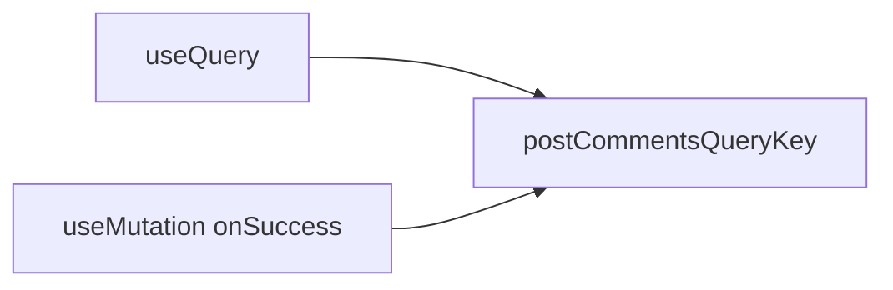
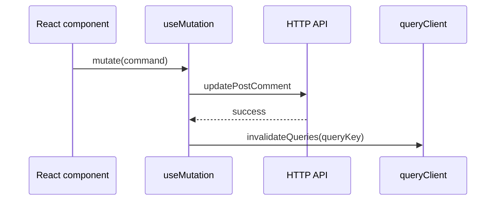
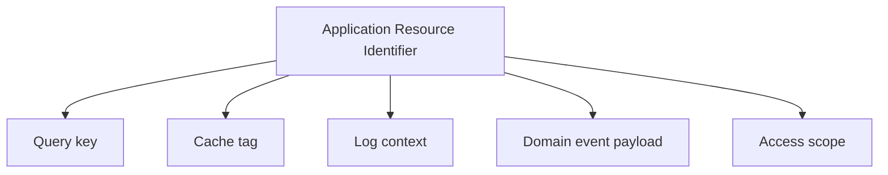

If you build React apps with TanStack Query, you have almost certainly written code like this:

```ts
const mutation = useMutation({
  mutationFn: updatePostComment,
  onSuccess: () => {
    queryClient.invalidateQueries({
      queryKey: ["post-comments", { postId, authorId }],
    });
  },
});
```

A component triggers a mutation. The mutation succeeds. Now you must refresh the stale UI — so you reach for `queryClient` and invalidate a few queries.

This is the **common** path: infrastructure orchestration living inside a hook, tied to client-side **React** and **TanStack Query**.

There's more. In the example above, the `queryKey` is assembled inline. The same tuple is likely repeated wherever that resource is read or invalidated — another mutation, another hook, another screen. TypeScript will not catch a drifted key: a renamed segment, a different object shape, or a stale prefix still type-checks, while `invalidateQueries` misses the cache entry that actually holds the data.

We need to do something about that...

---

## Step one: make query keys less painful

The usual first step is to DRY this up: extract a shared helper so every `useQuery` and `invalidateQueries` projects the same key.

Magic strings tend to spread. The same tuple gets copy-pasted between `useQuery` and `invalidateQueries`. Someone mis-types `"post-comment"` in one place and debugging becomes archaeology.

So you introduce helpers:

```ts
export const postCommentsQueryKey = (postId: string, authorId: string) => {
  return ["post-comments", { postId, authorId }];
};
```

Better. One source of truth. TypeScript can even keep the tuple honest.



This is a real win. But notice what you have actually centralized: **the shape of a TanStack Query key** — not the meaning of the resource itself.

---

## Step two: notice where the logic lives

Zoom out from the helper. The full story still looks like this:



Fetch orchestration, write orchestration, and cache invalidation are **woven into UI runtime code**.

That is fine for a small screen. It becomes expensive when you ask a harder question:

> What if the same flow had to run **outside** this hook — in a test, in a CLI, on the server, in another framework — without re-implementing the whole thing?

You would need to extract:

- what changed in the domain;
- which logical resources are now stale;
- how to tell whatever cache exists on that runtime to refresh.

But your helpers return **query keys**. Your invalidation API is **queryClient**. Your execution context is **the browser, inside React**.

The logic is not portable. It is **glued to a stack**.

---

## A representation that outlives the stack

Infrastructure already has stable identifiers everywhere:

- URLs
- database primary keys
- queue names
- cache keys

Application code, surprisingly, often doesn't. It still reaches for scattered strings and ad hoc tuples.

That is almost paradoxical. The layers below the UI are precise about _what_ they point at. The application layer — where business meaning lives — is the vague one.

The move is to name things at a higher level: not “the cache entry keyed like `['post-comments', …]`”, but **the resource itself** — comments for this post and author.

Call it an **Application Resource Identifier** (ARI).

Small factory, talking the application language:

```ts
import { ari } from "@xndrjs/application-resources";

export const postCommentsResource = (params: { postId: string; authorId: string }) =>
  ari("post-comments", [
    {
      postId: params.postId,
      authorId: params.authorId,
    },
  ]);
```

A resource has a **`type`** (the "family") and a **`key`** (the structural parts that identify an instance). That is application language. No React. No TanStack. No `queryClient`.

The goal is a **shared language** across layers: every layer of the application should refer to the same resource using the same identifier. The mutation hook, the write adapter, the cache invalidator, and the logger all mean the same thing when they point at `postCommentsResource({ postId, authorId })` — not five slightly different tuples.

---

## What an Application Resource Identifier is (and isn't)

An Application Resource Identifier (ARI) is an identifier for application resources.

An application resource is not necessarily a single entity. It is an addressable scope the application can reason about — for loading, caching, invalidation, authorization, or orchestration. For example: invalidating “all products” names that scope; it does not imply those products were loaded as a unit.

An ARI intentionally says nothing about how a resource is obtained or represented. It only identifies **what** the resource is.

### An ARI is...

- An identifier for an application resource, which may represent a single item, a collection, or a broader scope.
- Scoped, allowing arbitrary levels of granularity.

For example:

```ts
// all post comments
ari("post-comments", []);
// all post comments by a specific author
ari("post-comments", [{ authorId }]);
// all post comments on a specific post
ari("post-comments", [{ postId }]);
// all post comments by a specific author on a specific post
ari("post-comments", [{ authorId, postId }]);
```

The scoping is defined by the application, not by the domain.

### An ARI is not...

#### ...a domain reference

Domain relationships belong to the domain model.

```ts
type Post = {
  authorId: AuthorId;
};
```

An ARI does not replace those references. It exists for application-level concerns such as loading, cache invalidation, authorization, logging, or event routing.

#### ...a URI or URL

An ARI is not a universal identifier.

A URI identifies a resource within a global addressing scheme. It is meant to be meaningful across systems and boundaries.

An ARI exists inside a specific application. It identifies a resource according to that application's own vocabulary, use cases, and boundaries.

The same underlying concept may have different ARIs in different applications.

For example, one application may identify a `Project` as:

```ts
ari("project", [{ projectId }]);
```

while another application may address the same underlying data as:

```ts
ari("organization-projects", [{ organizationId, projectId }]);
```

Neither is more correct. They represent different application models.

Another example:

Application A may have:

```ts
ari("customer-orders", [{ customerId }]);
```

Application B may have:

```ts
ari("sales-dashboard", [{ regionId }]);
```

They may be composed from the same underlying domain data, but represent different resources in each application's model.

An ARI is not a location. It does not tell you where data lives, which service owns it, or how to retrieve it. It only provides a stable way for an application to refer to something it can reason about.

An ARI identifies **what** the application can talk about, not **how** that information is stored, fetched, or represented.

---

## Why an ARI is not a query key

A **query key** exists for one job: identify an entry in a **client-side memoization cache**. It is an implementation detail of a specific library.

An **application resource identifier** names a **resource** — or a scope of resources — in your application model.

You _can_ derive a query key from it:

```ts
queryClient.invalidateQueries({
  queryKey: postCommentsResource({ postId, authorId }).toArray(),
});
```

But you are not **limited** to that. The identifier is the concept. The query key is one possible **projection** / **use**.



Once you stop equating “resource” with “query key”, other uses appear almost immediately.

---

## The same idea, many adapters

### Access control

Describe what a role may do on which resources:

```ts
canRead(role, postCommentsResource({ postId, authorId }));
```

The check is about **resources**, not about how data was cached on the client.

### In-flight deduplication

With [`@xndrjs/tasks`](/v0/infrastructure/tasks/), use a stable string form of the resource as a dedup key:

```ts
const resource = postCommentsResource({ postId, authorId });

return (
  task(() => loadPostComments(resource))
    // concurrent callers share one in-flight promise until it settles
    .inflightDedup(Symbol.for(resource.format()))
);
```

Same resource, same promise — no accidental duplicate fetches.

### Error reporting

When something fails, log **which resource** was involved:

```ts
logger.error("Failed to load resource", { resource: resource.format() });
```

### Server cache tags

On the server, CDN, or Next.js, turn the resource into a tag:

```ts
revalidateTag(postResource({ postId }).format());
```

### Application events

```ts
const event = {
  name: "post.comment.updated",
  occurredAt: new Date(),
  affectedResources: [
    postCommentsResource({ postId, authorId }),
    postResource({ postId }),
    // ...other resources...
  ],
};
```

Invalidating TanStack Query after a mutation is just **one adapter** in a larger picture — a small translation at the edge, not the definition of the concept.

---

## Clean Architecture: invalidate without contaminating the codebase

Now the interesting rearrangement.

Instead of invalidating inside `onSuccess`, declare a port in the application layer:

```ts
export type CoreResourceIdentifier =
  | ReturnType<typeof postCommentsResource>
  | ReturnType<typeof postResource>;

export interface ResourceInvalidator {
  invalidate(resources: CoreResourceIdentifier[]): Promise<void>;
}

export interface PostCommentsPort {
  update(command: UpdatePostCommentCommand): Promise<void>;
}
```

The use case orchestrates application logic:

```ts
export class UpdatePostComment {
  constructor(private readonly comments: PostCommentsPort) {}

  async execute(command: UpdatePostCommentCommand) {
    await this.comments.update(command);
  }
}
```

Somewhere in **infrastructure**, an adapter performs the write and decides which resources to invalidate — without pushing that concern into the use case:

```ts
export class HttpPostCommentsAdapter implements PostCommentsPort {
  constructor(
    private readonly httpClient: HttpClient,
    private readonly invalidator: ResourceInvalidator
  ) {}

  async update(command: UpdatePostCommentCommand) {
    await this.httpClient.post("/post-comments", command);

    await this.invalidator.invalidate([
      postCommentsResource({
        postId: command.postId,
        authorId: command.authorId,
      }),
    ]);
  }
}
```

Who implements `ResourceInvalidator`? Still **infrastructure** — for example, an adapter backed by TanStack Query:

```ts
export class TanStackResourceInvalidator implements ResourceInvalidator {
  constructor(private readonly queryClient: QueryClient) {}

  async invalidate(resources: CoreResourceIdentifier[]) {
    await Promise.all(
      resources.map((resource) =>
        this.queryClient.invalidateQueries({
          queryKey: resource.toArray(),
        })
      )
    );
  }
}
```

TanStack Query is still there. It is just no longer the **vocabulary** of your whole application. It is an implementation detail behind a narrow seam.

The React mutation can become thin: call the use case, and let an infrastructure adapter own invalidation through the port when a write completes.

---

## A small library for many use cases

[`@xndrjs/application-resources`](https://github.com/xndrjs/toolkit/tree/main/packages/application-resources) does not fetch data, manage React, or wrap TanStack.

It gives you a consistent way to **define** resources in application code:

```ts
const resource = postCommentsResource({
  postId: "post-123",
  authorId: "author-456",
});

resource.type; // "post-comments"
resource.toArray(); // adapter-friendly projection
resource.format(); // stable string for tags, logs, dedup keys
resource.equals(other);
```

Zero runtime dependencies. Framework-agnostic. Boring on purpose — so the interesting part is the **architecture**, not the utility.

---

## Try it

```bash
npm install @xndrjs/application-resources
```

Package docs: [Application resources](/v0/application/application-resources/). API reference: [API surface](/v0/reference/api-surface/#xndrjsapplication-resources).
