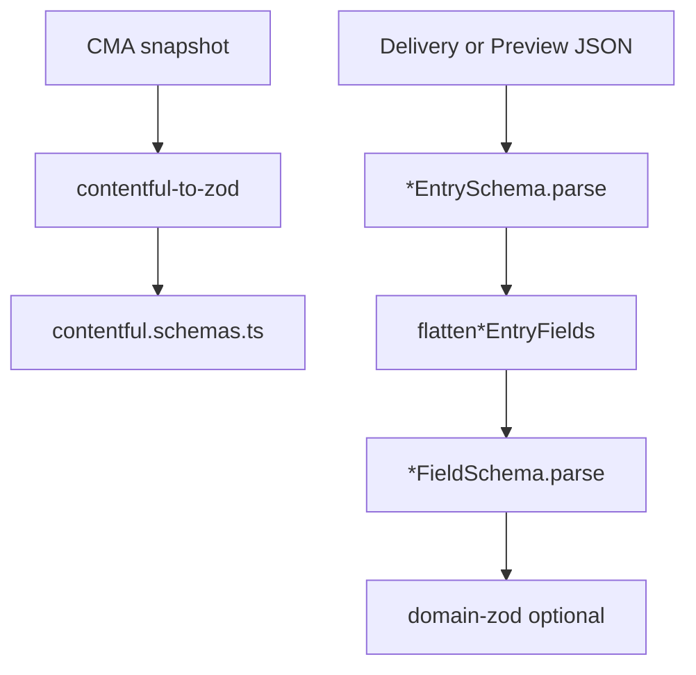

`@xndrjs/contentful-to-zod` generates **Zod 4** schemas from your Contentful content model (CMA). It belongs in the **infrastructure layer**: build-time codegen plus runtime parsing at the Delivery/Preview boundary.

The generated file is self-contained — production code depends only on **`zod`**, not on `@xndrjs/contentful-to-zod`. It outputs Zod schemas and optional locale helpers; no `domain.shape` is emitted. Wire flat schemas into `@xndrjs/domain-zod` in your own code when you use xndrjs.

For the motivation behind transport-aware schemas (why CMA `required` ≠ runtime certainty), see [Your CMS schema is lying to TypeScript](/latest/blog/your-cms-schema-is-lying-to-typescript/).



## Install

```bash
pnpm add zod@^4
pnpm add -D @xndrjs/contentful-to-zod @dotenvx/dotenvx
```

## CLI

Because `@xndrjs/contentful-to-zod` is a codegen dependency, add scripts to `package.json` and run the local CLI through your package manager. The CLI reads `CONTENTFUL_SPACE_ID`, `CONTENTFUL_MANAGEMENT_TOKEN`, and `CONTENTFUL_ENVIRONMENT` from env, so you can keep credentials in `.env`:

```dotenv
CONTENTFUL_SPACE_ID=your_space_id
CONTENTFUL_MANAGEMENT_TOKEN=your_management_token
CONTENTFUL_ENVIRONMENT=master
```

```json
{
  "scripts": {
    "contentful:schema": "dotenvx run -- contentful-to-zod --out ./src/generated/contentful.schemas.ts --snapshot ./src/generated/content-types.json --snapshot-locales ./src/generated/locales.json"
  }
}
```

Live fetch from CMA (writes snapshots for reproducible CI):

```bash
pnpm run contentful:schema
```

For a one-off run, you can also use `npx`:

```bash
npx @dotenvx/dotenvx run -- npx @xndrjs/contentful-to-zod \
  --out ./src/generated/contentful.schemas.ts \
  --snapshot ./src/generated/content-types.json \
  --snapshot-locales ./src/generated/locales.json
```

Other flags: `--content-types blogPost,author`, `--config ./contentful-to-zod.config.ts`, `--dry-run` (print to stdout).

Environment fallbacks: `CONTENTFUL_MANAGEMENT_TOKEN`, `CONTENTFUL_SPACE_ID`, `CONTENTFUL_ENVIRONMENT`.

## Config — `locale.mode`

In `contentful-to-zod.config.ts` (or `generateZodSchemas` options):

```ts
import { defineConfig } from "@xndrjs/contentful-to-zod";

export default defineConfig({
  locale: {
    /** Default: "both" */
    mode: "both", // "cma" | "delivery" | "both"
  },
});
```

| `locale.mode`      | Generated exports                                                                          |
| ------------------ | ------------------------------------------------------------------------------------------ |
| `"cma"`            | Flat field schemas only (`BlogPostFieldSchema`, `BlogPostFields`)                          |
| `"delivery"`       | Delivery field schemas + entry wrappers + `pickLocale` + locale enum/constants             |
| `"both"` (default) | Flat + delivery field schemas + entry wrappers + `pickLocale` + `flatten{Type}EntryFields` |

Rules:

- **Flat field schemas** (`*FieldSchema`) wrap every field in **`flatField()`** — for use after `flatten*EntryFields` (or direct parse of a flat shape).
- **Delivery field schemas** (`*DeliveryFieldsSchema`, `*EntrySchema`) wrap every field in **`transportField()`**. CMA `required` does **not** apply at the transport boundary.
- **`localized: true`** — flat uses `flatField(T)`; delivery uses `transportField(z.record(ContentfulLocaleCodeSchema, T))`.
- **`disabled` / `omitted`** fields are still included (full blueprint).

## Generated output

For a content type `blogPost`, expect:

| Export                                                    | Role                                                      |
| --------------------------------------------------------- | --------------------------------------------------------- |
| `BlogPostFieldSchema` / `BlogPostFields`                  | Flat / single-locale field shape                          |
| `BlogPostDeliveryFieldsSchema` / `BlogPostDeliveryFields` | Delivery `fields` object                                  |
| `BlogPostEntrySchema` / `BlogPostEntry`                   | Full entry wrapper for Delivery/Preview JSON              |
| `flattenBlogPostEntryFields`                              | Map validated `entry.fields` → flat fields for one locale |
| `pickLocale`                                              | Read one locale from a localized delivery field           |
| `ContentfulLocaleCodeSchema`, `CONTENTFUL_DEFAULT_LOCALE` | Locale enum from your space snapshot                      |

The generator emits two names for the **same** normalization logic:

```ts
// Same implementation: missing key or explicit null → null
export function transportField<T extends z.ZodType>(schema: T) {
  return schema
    .nullable()
    .optional()
    .transform((v) => v ?? null);
}

export function flatField<T extends z.ZodType>(schema: T) {
  return schema
    .nullable()
    .optional()
    .transform((v) => v ?? null);
}
```

**Why two names?** So you can tell which layer you are validating at a glance: `transportField` wraps delivery/preview payloads; `flatField` wraps the single-locale shape after flatten.

```ts
export const BlogPostDeliveryFieldsSchema = z.object({
  title: transportField(z.record(ContentfulLocaleCodeSchema, z.string().max(256))),
  slug: transportField(z.string()),
  author: transportField(ContentfulEntryLinkSchema),
});

export const BlogPostFieldSchema = z.object({
  title: flatField(z.string().max(256)),
  slug: flatField(z.string()),
  author: flatField(ContentfulEntryLinkSchema),
});

export const BlogPostEntrySchema = z.object({
  sys: ContentfulEntrySysSchema.extend({
    /* contentType id literal */
  }),
  fields: BlogPostDeliveryFieldsSchema,
});
```

`z.infer<typeof BlogPostFields>["title"]` is `string | null` — honest types for what can actually arrive.

## Runtime pipeline

Parse at the boundary, flatten fields, then validate the flat shape:

```ts
import {
  BlogPostEntrySchema,
  BlogPostFieldSchema,
  flattenBlogPostEntryFields,
} from "./generated/contentful.schemas";

const entry = BlogPostEntrySchema.parse(rawFromContentful);
const flat = flattenBlogPostEntryFields(entry.fields, "it-IT");
const post = BlogPostFieldSchema.parse(flat);
```

`flatten*EntryFields` accepts **only** validated `entry.fields` — not the full entry. First parse with `*EntrySchema`, then flatten.

Helpers **do not validate** — always `parse` after flattening. For pages that require a real title, tighten in your domain layer:

```ts
const PublishedPost = BlogPostFieldSchema.extend({
  title: z.string().min(1),
});
const trusted = PublishedPost.parse(flat);
```

## Object field overrides

CMA `Object` fields have no inner shape. Supply Zod schemas via config:

```ts
import { z } from "zod";
import { defineConfig } from "@xndrjs/contentful-to-zod";

export default defineConfig({
  objects: {
    "blogPost.metadata": z.object({
      seoTitle: z.string(),
      noIndex: z.boolean().optional(),
    }),
  },
});
```

Overrides apply to the **base field type** `T`. Localized fields wrap `transportField(z.record(ContentfulLocaleCodeSchema, T))` around that base in delivery mode.

Overrides are inlined at codegen time — the config is not imported at runtime.

## Programmatic API

```ts
import { fetchContentTypes, fetchLocales, generateZodSchemas } from "@xndrjs/contentful-to-zod";
import { writeFile } from "node:fs/promises";

const cma = { spaceId, accessToken, environmentId: "master" };

const [contentTypes, locales] = await Promise.all([fetchContentTypes(cma), fetchLocales(cma)]);

const source = generateZodSchemas(contentTypes, {
  locales,
  config: { locale: { mode: "both" } },
});

await writeFile("./src/generated/contentful.schemas.ts", source, "utf8");
```

`generateZodSchemas` options: `contentTypeIds`, `locales` (required when mode is `delivery` or `both`), `localeMode`, `config`.

## Wiring to domain-zod

Transport schemas feed the domain; they do not replace it. See the [Zod adapter](/latest/v0/adapters/zod/) for `zodToValidator`:

```ts
import { domain, zodToValidator } from "@xndrjs/domain-zod";
import { BlogPostFieldSchema, ContentfulLocaleCodeSchema } from "./generated/contentful.schemas";

export const BlogPost = domain.shape("BlogPost", zodToValidator(BlogPostFieldSchema));

export const SupportedLocale = domain.primitive(
  "SupportedLocale",
  zodToValidator(ContentfulLocaleCodeSchema)
);
```

## CMA field mapping

| CMA `type`   | Zod base                                               |
| ------------ | ------------------------------------------------------ |
| Symbol, Text | `z.string()` + validations                             |
| Integer      | `z.number().int()`                                     |
| Number       | `z.number()`                                           |
| Boolean      | `z.boolean()`                                          |
| Date         | `z.string()` / `z.iso.datetime()`                      |
| Location     | `z.object({ lat, lon })`                               |
| Object       | `z.record(z.string(), z.unknown())` or config override |
| Link         | Contentful link object                                 |
| Array        | `z.array(itemSchema)`                                  |
| Rich Text    | `z.looseObject({ nodeType: z.literal("document") })`   |

Entry/asset link objects and CMA validations (size, range, regex, etc.) are reflected in the generated Zod chains.

## See also

- [Your CMS schema is lying to TypeScript](/latest/blog/your-cms-schema-is-lying-to-typescript/) — transport vs domain trust
- [Package map](/latest/v0/reference/package-map/) — where this package fits in the toolkit
- [README in the monorepo](https://github.com/xndrjs/toolkit/tree/main/packages/contentful-to-zod) — CLI details when working on the generator itself
