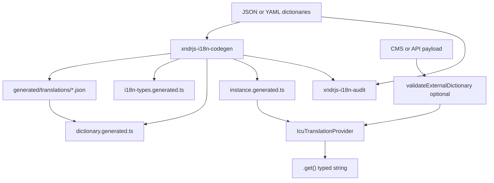

`@xndrjs/i18n` is a **compiler-first, type-safe i18n system** based on [ICU MessageFormat](https://formatjs.github.io/docs/core-concepts/icu-syntax/). Local dictionary files (JSON or YAML) act as **typed fallbacks**; a build-time codegen step parses ICU templates and generates exact TypeScript types for keys and parameters. At runtime, a provider caches compiled messages and lets you replace the dictionary — or a single namespace — from any external source without rebuilding.

For motivation and design trade-offs, see [Type-safe i18n with runtime overrides](/latest/blog/type-safe-i18n-with-runtime-overrides/).



## Install

```bash
pnpm add @xndrjs/i18n zod
pnpm add -D tsx
```

| Dependency     | Role                                                                                                                                 |
| -------------- | ------------------------------------------------------------------------------------------------------------------------------------ |
| `@xndrjs/i18n` | Runtime providers, validation helpers, codegen CLI (`xndrjs-i18n-codegen`), audit CLI (`xndrjs-i18n-audit`)                          |
| `tsx`          | **Peer dependency** (dev) — codegen and audit CLIs run TypeScript directly                                                           |
| `zod`          | **Peer dependency** — validates `i18n.codegen.json`; also powers `validateExternalDictionary()` when `dictionarySchemaOutput` is set |

Production bundles depend on `@xndrjs/i18n` and `intl-messageformat` (pulled in by the package). Codegen runs at build time only.

## Scaffold and codegen

### Setup CLI

```bash
pnpm --filter YourPackageOrAppName exec xndrjs-i18n-setup single . --project MyApp
pnpm --filter YourPackageOrAppName exec xndrjs-i18n-setup multi apps/myapp --project MyApp
```

This creates under the target directory (for example `i18n/` or `src/i18n/`):

- `i18n.codegen.json`
- starter translation files (JSON by default; YAML supported)
- `index.ts` exporting `createI18n()` and generated types

Pass `src` as the target when your app uses a `src/` layout.

### Codegen script

Add to `package.json`:

```json
{
  "scripts": {
    "i18n:codegen": "xndrjs-i18n-codegen --config i18n/i18n.codegen.json",
    "i18n:audit": "xndrjs-i18n-audit --config i18n/i18n.codegen.json"
  }
}
```

Run after every change to translation files (JSON or YAML) — or wire into your build:

```bash
pnpm --filter YourPackageOrAppName run i18n:codegen
```

Default config path is `i18n/i18n.codegen.json`. Paths inside the config are relative to the directory containing that file.

### Audit script

```bash
# Report to stdout (exit 0 even when gaps exist)
pnpm --filter YourPackageOrAppName exec xndrjs-i18n-audit --config i18n/i18n.codegen.json

# Write the same JSON report to a file
pnpm --filter YourPackageOrAppName exec xndrjs-i18n-audit --config i18n/i18n.codegen.json --out audit.json

# CI gate: exit 1 when runtime would still miss strings after fallback
pnpm --filter YourPackageOrAppName exec xndrjs-i18n-audit --config i18n/i18n.codegen.json --fail-on effective
```

| Flag                                   | Purpose                                                                                                                                                                                                        |
| -------------------------------------- | -------------------------------------------------------------------------------------------------------------------------------------------------------------------------------------------------------------- |
| `--config <path>`                      | Path to `i18n.codegen.json` (default: `i18n/i18n.codegen.json` relative to cwd).                                                                                                                               |
| `--out <path>`                         | Write the JSON report to a file instead of stdout.                                                                                                                                                             |
| `--fail-on effective \| direct \| any` | Optional. Without it, the CLI always exits `0` (report-only). With it, exits `1` when gaps remain: `effective` = `.get()` would throw; `direct` = no string in the dictionary for that locale; `any` = either. |
| `--allow-empty`                        | Treat `""` as a valid template (default: empty strings count as missing).                                                                                                                                      |

Produces a JSON report of missing translations per namespace and locale. **`requiredLocales`** are all locales your i18n instance can use.

| Report field               | Meaning                                                                                                                                              |
| -------------------------- | ---------------------------------------------------------------------------------------------------------------------------------------------------- |
| `missingDirectByLocale`    | The key has no string for that locale in the dictionary. Often fine at runtime if fallback supplies another locale — mainly a translator to-do list. |
| `missingEffectiveByLocale` | No string for that locale, and fallback cannot find one either. `.get()` would throw — fix before shipping.                                          |

When `localeFallback` is set in config, codegen enriches generated `LOCALE_FALLBACK` with `[locale]: null` for every `MyProjectLocale` not explicitly configured (runtime unchanged).

## Translation dictionaries

Each key maps locale codes to ICU strings: `key → locale → template`. Paths in `i18n.codegen.json` may use `.json`, `.yaml`, or `.yml` (see [YAML authoring](#yaml-authoring) below).

### JSON example

```json
{
  "login_button": { "en": "Login", "it": "Accedi" },
  "welcome": { "en": "Welcome {name}!", "it": "Benvenuto {name}!" },
  "dashboard_status": {
    "en": "You have {msgCount, plural, one {1 message} other {# messages}} in {chatCount, plural, one {one chat} other {# chats}}",
    "it": "Hai {msgCount, plural, one {1 messaggio} other {# messaggi}} in {chatCount, plural, one {una chat} other {# chat}}"
  }
}
```

Inside a `plural` or `selectordinal` branch, ICU `#` stands in for the numeric argument, formatted for the locale.

## YAML authoring

YAML is an optional **authoring** format for dictionaries — mainly for **multiline ICU**: several parameters on separate lines, or plural/select branches that are unreadable as a single JSON string. **YAML never reaches production:** codegen compiles it to JSON under **`{dirname(typesOutput)}/translations/`** (for example `generated/translations/billing.json`). Generated TypeScript imports that compiled JSON at runtime; validation, lazy loaders, and `setNamespace()` behave the same as for hand-written JSON.

YAML block scalars keep complex ICU readable in source while preserving (or intentionally folding) line breaks.

```yaml
# translations/billing.yaml
appointment_summary:
  en: |
    Due {dueDate, date, short}
    at {startTime, time, short}
  it: |
    Scade il {dueDate, date, short}
    alle {startTime, time, short}

invoice_summary:
  en: |
    You have {count, plural,
      zero {no invoices}
      one {one invoice}
      other {# invoices}
    }
```

Workflow:

1. Edit `.yaml` / `.yml` under `translations/` (or keep `.json` where it is enough).
2. Run `xndrjs-i18n-codegen`.
3. Commit the YAML source; treat `generated/translations/*.json` as build output (commit or regenerate in CI).

**Mixed namespaces** are supported — for example `default.json` plus `billing.yaml` in the same `namespaces` map.

Codegen logs compiled files: `Compiled: translations/billing.yaml → generated/translations/billing.json`.

### Markdown and HTML in strings

`@xndrjs/i18n` formats ICU parameters only — it does not render Markdown, HTML, or layout. Long pages (legal copy, policies, emails) usually belong in a **content template** (for example Handlebars) with localized strings inside, not in one giant i18n key.

If markup does appear in a string, unquoted `<tags>` are parsed as ICU syntax, not literal HTML — quote them (for example `'<strong>'`) or use HTML entities (`&lt;strong&gt;`).

### Serving compiled JSON from `public/`

You can copy `generated/translations/*.json` to `public/i18n/` at build time and load them with `fetch()` at runtime, then `validateExternalNamespace()` + `setNamespace()`. That is a **project configuration** choice — the library does not require it, but runtime validation and overrides support it.

## Codegen pipeline

`xndrjs-i18n-codegen` parses every ICU string with `@formatjs/icu-messageformat-parser` and infers parameter types:

| ICU construct                             | Inferred type |
| ----------------------------------------- | ------------- |
| Simple argument `{name}`                  | `string`      |
| `plural` argument `{count, plural, ...}`  | `number`      |
| `select` argument `{gender, select, ...}` | `string`      |
| No variables                              | `never`       |

Variables found across **all locales** of the same key are merged. If parsing fails for any key/locale, codegen prints a contextual error and exits non-zero (CI/build blocker).

### Generated files

| File                             | Contents                                                                    |
| -------------------------------- | --------------------------------------------------------------------------- |
| `i18n-types.generated.ts`        | `I18N_MODE`, `MyProjectParams`, `MyProjectSchema`, locale union             |
| `dictionary.generated.ts`        | Imports JSON (source or YAML-compiled) and assembles the initial dictionary |
| `instance.generated.ts`          | Exports `createI18n()` — typed factory with fallback dictionary             |
| `dictionary-schema.generated.ts` | Optional — `DICTIONARY_SPEC`, `validateExternalDictionary()`                |
| `namespace-loaders.generated.ts` | Optional — lazy loaders and `ensureNamespacesLoaded()`                      |

Example generated params (multi-namespace):

```ts
export type MyProjectParams = {
  default: {
    login_button: never;
    welcome: { name: string };
    dashboard_status: { msgCount: number; chatCount: number };
  };
  billing: {
    invoice_summary: { count: number };
  };
};
```

## Single file vs multi-namespace

Specify **exactly one** of `dictionary` (single) or `namespaces` (multi) in `i18n.codegen.json`.

|              | Single-file                    | Multi-namespace                               |
| ------------ | ------------------------------ | --------------------------------------------- |
| `I18N_MODE`  | `'single'`                     | `'multi'`                                     |
| Provider     | `IcuTranslationProviderSingle` | `IcuTranslationProviderMulti`                 |
| `.get()`     | `get(key, locale, params?)`    | `get(namespace, key, locale, params?)`        |
| Override     | `setAll(schema)`               | `setAll(schema)` + `setNamespace(ns, values)` |
| Lazy loading | Not supported                  | `loadOnInit` + `ensureNamespacesLoaded()`     |

**Single-file** — one JSON, flat API, simplest integration:

```ts
import { i18n } from "./i18n";

i18n.get("login_button", "it");
i18n.get("welcome", "en", { name: "Ada" });
```

**Multi-namespace** — split by domain, partial overrides, code-splitting:

```ts
i18n.get("default", "login_button", "it");
i18n.get("billing", "invoice_summary", "en", { count: 12 });

// compile-time errors:
i18n.get("default", "welcome", "it"); // missing { name }
i18n.get("billing", "login_button", "it"); // key not in namespace
```

To migrate: split JSON, change `dictionary` → `namespaces`, re-run codegen, update call sites.

## Runtime provider

Create a provider with the generated factory (no side effects at import time):

```ts
import { createI18n } from "./i18n/generated/instance.generated.js";

export const i18n = createI18n();
// or hydrate at init:
export const i18n = createI18n(externalDictionary);
```

Or use the scaffolded singleton in `i18n/index.ts`:

```ts
import { createI18n } from "./generated/instance.generated.js";

export * from "./generated/instance.generated.js";
export * from "./generated/i18n-types.generated.js";

export const i18n = createI18n();
```

### `forLocale`

Bind a locale once and omit it on every `.get()`:

```ts
const i18nEn = i18n.forLocale("en");

i18nEn.get("login_button"); // single-file
i18nEn.get("welcome", { name: "Ada" });

const i18nIt = i18n.forLocale("it");
i18nIt.get("default", "login_button"); // multi
i18nIt.get("billing", "invoice_summary", { count: 3 });
```

The bound view shares dictionary, cache, and fallback rules with the parent.

### Provider API

Both providers share:

| Method                      | Behavior                                                       |
| --------------------------- | -------------------------------------------------------------- |
| `.get(...)`                 | Format a key for a locale; TypeScript enforces required params |
| `.forLocale(locale)`        | Locale-bound view with narrower `.get()` signature             |
| `.getAll()`                 | Deep-frozen snapshot of the current dictionary                 |
| `.setAll(values)`           | Replace dictionary; clear compilation cache                    |
| `.setNamespace(ns, values)` | Multi only — patch one namespace; invalidate its cache entries |
| `.hasNamespace(ns)`         | Multi only — whether namespace is loaded                       |

Compiled `IntlMessageFormat` instances are cached per locale (and per namespace in multi mode).

### `getAll()` for dynamic access

Codegen types the happy path. For admin tools, diff views, or CMS previews:

```ts
const snapshot = i18n.getAll();
const label = snapshot.default.login_button.en;
```

## Locale fallback

When a template is **missing** for the requested locale (`undefined` in the dictionary), the provider walks a configured fallback chain before throwing. An empty string `""` is a **valid template** and does **not** trigger fallback.

```json
"localeFallback": {
  "en": null,
  "de-DE": "en",
  "de-CH": "de-DE",
  "it": "en"
}
```

- `null` — terminal locale (stop walking).
- Any other value — next locale to try, recursively.
- Cycles are rejected at provider construction and during resolution.

Codegen emits `LOCALE_FALLBACK` and extends the locale union. The generated `createI18n()` wires the map automatically.

Partial regional locales (for example `en-US` overriding only a subset of keys, falling back to `en`) are a common use case — you do not need to duplicate the full dictionary for every variant.

### `projectLocales`

Lazy namespaces reduce payload by **domain**; `projectLocales` reduces it by **locale**. Each loaded namespace still contains every locale unless you trim it. In production you usually need **one locale at a time** (or a small regional set), not the full matrix.

`projectLocales` projects the full schema; in multi mode `projectNamespaceLocales` projects one namespace. Missing entries are filled via `localeFallback` (same rules as `.get()`), then you pass the result to `setAll()` or `setNamespace()`.

```ts
import { createI18n, projectNamespaceLocales } from "./i18n/generated/instance.generated.js";
import billingDictionary from "./i18n/translations/billing.json";

const i18n = createI18n();
i18n.setNamespace("billing", projectNamespaceLocales(billingDictionary, [activeLocale]));
```

Codegen emits typed helpers in `instance.generated.ts`: `projectLocales` for the full schema (`setAll`), and in multi mode `projectNamespaceLocales` for a single namespace (`setNamespace`). Both wire in `LOCALE_FALLBACK` and type locales as `MyProjectLocale[]`.

Common deployment patterns:

- **API** — resolve `projectNamespaceLocales(billingDict, [locale])` or `projectLocales(fullDict, [locale])` per request and return JSON.
- **Cache** — precompute per-locale (or per-region) slices in Redis; fetch the small blob at runtime.
- **`public/`** — build step emits `billing.it.json`, `billing.de-CH.json`, etc.; `fetch` + validate + `setNamespace`.

Full dictionary remains the source of truth; projection happens at the boundary.

Use `xndrjs-i18n-audit` to measure coverage: `missingDirectByLocale` lists keys without a template for that locale (translator backlog); `missingEffectiveByLocale` lists keys that would still fail at runtime after walking the fallback chain. See [Audit script](#audit-script).

If the chain exhausts without a template, `.get()` throws and includes the full chain:

```text
[i18n] Missing key or locale: "welcome" [de-CH] (fallback chain: de-CH → de-DE → en)
```

## Runtime override

Local JSON defines the **contract** and **fallback values**. At runtime, replace or patch:

```ts
// Full override — replaces everything, clears cache
i18n.setAll(externalPayload);

// Partial patch — multi only; invalidates one namespace cache
i18n.setNamespace("billing", externalBillingPayload);
```

## Lazy namespace loading (multi mode)

List namespaces needed at startup in `loadOnInit`. Codegen emits dynamic `import()` loaders and `ensureNamespacesLoaded()`. `.get()` stays synchronous — preload before rendering.

```json
{
  "namespaces": {
    "default": "translations/default.json",
    "billing": "translations/billing.yaml"
  },
  "loadOnInit": ["default"],
  "dictionarySchemaOutput": "generated/dictionary-schema.generated.ts",
  "namespaceLoadersOutput": "generated/namespace-loaders.generated.ts"
}
```

```ts
import { i18n, ensureNamespacesLoaded } from "./i18n";

i18n.get("default", "login_button", "en");

await ensureNamespacesLoaded(i18n, ["billing"]);
i18n.get("billing", "invoice_summary", "en", { count: 12 });
```

Calling `.get()` on an unloaded namespace throws:

```text
[i18n] Namespace not loaded: "billing". Call ensureNamespacesLoaded(i18n, ["billing"]) first.
```

When `loadOnInit` is omitted, all namespaces are statically imported (default eager behavior). `loadOnInit` is **multi mode only** — codegen fails if used with single-file config.

Lazy mode requires `dictionarySchemaOutput` and `zod` in the consumer app (validation runs before a namespace is registered).

## External dictionary validation

When translations arrive from a CMS or API, validate `unknown` input before `setAll()` or `setNamespace()`:

```json
{
  "dictionarySchemaOutput": "generated/dictionary-schema.generated.ts"
}
```

Codegen emits `validateExternalDictionary()` and, in multi mode, `validateExternalNamespace()`:

```ts
import { formatIssues } from "@xndrjs/i18n/validation";
import { validateExternalDictionary } from "./i18n/generated/dictionary-schema.generated.js";
import { i18n } from "./i18n";

const raw: unknown = await loadTranslations();
const result = validateExternalDictionary(raw);

if (!result.ok) {
  console.error(formatIssues(result.issues));
  return;
}

i18n.setAll(result.data);
```

Validation runs in two phases:

1. **Normalize** — parse ICU templates, extract variables, check required keys (missing keys fail; extra keys ignored; partial locales OK).
2. **Validate** — compare extracted arguments against the static `Params` schema via Zod.

Low-level helpers are also exported from `@xndrjs/i18n/validation` for custom wiring.

## Configuration — `i18n.codegen.json`

### Single-file

```json
{
  "dictionary": "translations/translations.json",
  "defaultNamespace": "default",
  "typesOutput": "generated/i18n-types.generated.ts",
  "dictionaryOutput": "generated/dictionary.generated.ts",
  "instanceOutput": "generated/instance.generated.ts",
  "paramsTypeName": "MyProjectParams",
  "schemaTypeName": "MyProjectSchema",
  "localeTypeName": "MyProjectLocale",
  "factoryName": "createI18n",
  "localeFallback": {
    "en": null,
    "de-DE": "en",
    "de-CH": "de-DE",
    "it": "en"
  }
}
```

### Multi-namespace

```json
{
  "namespaces": {
    "default": "translations/default.json",
    "user": "translations/user.json",
    "billing": "translations/billing.yaml"
  },
  "typesOutput": "generated/i18n-types.generated.ts",
  "dictionaryOutput": "generated/dictionary.generated.ts",
  "instanceOutput": "generated/instance.generated.ts",
  "paramsTypeName": "MyProjectParams",
  "schemaTypeName": "MyProjectSchema",
  "localeTypeName": "MyProjectLocale",
  "factoryName": "createI18n",
  "localeFallback": {
    "en": null,
    "de-DE": "en",
    "de-CH": "de-DE",
    "it": "en"
  }
}
```

| Field                               | Description                                                                                                       |
| ----------------------------------- | ----------------------------------------------------------------------------------------------------------------- |
| `dictionary`                        | Single dictionary path (`.json`, `.yaml`, or `.yml`). Mutually exclusive with `namespaces`.                       |
| `namespaces`                        | Map of `namespace → dictionary path` (`.json`, `.yaml`, or `.yml`). Mutually exclusive with `dictionary`.         |
| `defaultNamespace`                  | Single mode only. Internal label (default `"default"`). Not exposed in flat API.                                  |
| `typesOutput`                       | Generated types file path. Determines `generated/translations/` for YAML compile output (`dirname` of this path). |
| `dictionaryOutput`                  | Generated dictionary manifest path.                                                                               |
| `instanceOutput`                    | Generated factory path.                                                                                           |
| `importExtension`                   | Optional. Relative import suffix between generated `.ts` modules: `"none"` (default), `".ts"`, or `".js"`.        |
| `factoryName`                       | Exported factory name (default `createI18n`).                                                                     |
| `paramsTypeName` / `schemaTypeName` | Generated type names.                                                                                             |
| `localeTypeName`                    | Generated locale union name (default `MyProjectLocale`).                                                          |
| `localeFallback`                    | Optional `locale → next locale \| null` map.                                                                      |
| `localeFallbackConstName`           | Generated constant name (default `LOCALE_FALLBACK`).                                                              |
| `dictionarySchemaOutput`            | Optional validation schema output. Requires `zod`.                                                                |
| `loadOnInit`                        | Multi only. Namespaces in the initial bundle via static imports.                                                  |
| `namespaceLoadersOutput`            | Lazy loaders output. Required when lazy namespaces exist.                                                         |

## Error semantics

| Condition                              | Error prefix / message                         |
| -------------------------------------- | ---------------------------------------------- |
| Missing key or locale (after fallback) | `[i18n] Missing key or locale: ...`            |
| Namespace not loaded                   | `[i18n] Namespace not loaded: ...`             |
| Malformed ICU in dictionary            | `[i18n ICU Syntax Error] ...`                  |
| Missing or invalid format params       | `[i18n Formatting Error] ...`                  |
| Circular locale fallback               | `[i18n] Circular locale fallback detected ...` |

## Public exports

From `@xndrjs/i18n`:

```ts
import {
  IcuTranslationProviderSingle,
  IcuTranslationProviderMulti,
  ensureNamespacesLoadedImpl,
  formatLocaleFallbackChain,
  resolveLocaleTemplate,
  validateLocaleFallback,
} from "@xndrjs/i18n";
```

From `@xndrjs/i18n/validation` (low-level; generated helpers wrap `DICTIONARY_SPEC` for you):

```ts
import {
  formatIssues,
  normalizeDictionary,
  parseTemplate,
  validateExternalDictionary,
  validateExternalNamespace,
} from "@xndrjs/i18n/validation";
```

When using the generated `dictionary-schema.generated.ts`, prefer `validateExternalDictionary(raw)` — it binds `DICTIONARY_SPEC` automatically.

Most apps use the **generated** `createI18n()` factory rather than constructing providers manually.

## See also

- [Type-safe i18n with runtime overrides](/latest/blog/type-safe-i18n-with-runtime-overrides/) — motivation and design
- [Package map](/v0/reference/package-map/) — where this package fits
- [Demo app in the monorepo](https://github.com/xndrjs/toolkit/tree/main/apps/i18n-demo) — single and multi examples
- [README in the monorepo](https://github.com/xndrjs/toolkit/tree/main/packages/i18n) — full reference when working on the package itself
