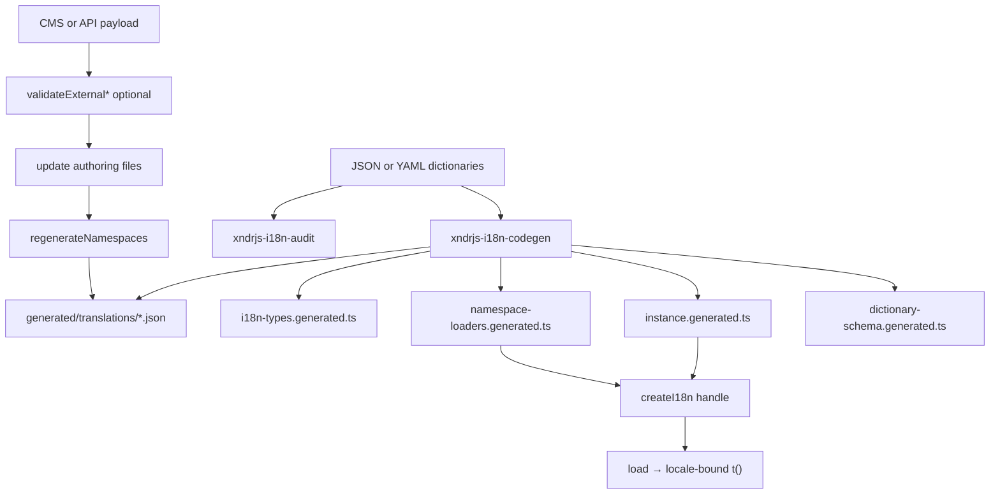

`@xndrjs/i18n` is a **compiler-first, type-safe i18n system** based on [ICU MessageFormat](https://formatjs.github.io/docs/core-concepts/icu-syntax/). Local dictionary files (JSON or YAML) are the authoring source; a build-time codegen step parses ICU templates and generates exact TypeScript types for keys and parameters. At runtime a shared **engine** caches compiled messages; a generated **handle** (`createI18n`) loads namespaces on demand and exposes typed `t()` on a locale-bound scope.

Namespaces are always multi-namespace (`t(namespace, key, params?)`). Delivery is `split-by-locale` (default) or `custom` areas — there is no single-file / eager-bundle mode.

For motivation and the developer journey (SSR/CSR, React gates, CMS refresh without rebuild), see [Type-safe i18n for TypeScript and React](/blog/type-safe-i18n-for-typescript-and-react/). React bindings live in [`@xndrjs/i18n-react`](/v0/infrastructure/i18n/react/).



## In this section

| Page                                                            | Topics                                                                      |
| --------------------------------------------------------------- | --------------------------------------------------------------------------- |
| [Dictionaries](/v0/infrastructure/i18n/dictionaries/)           | JSON shape, YAML authoring, serving from `public/`                          |
| [Delivery](/v0/infrastructure/i18n/delivery/)                   | Split-by-locale and custom areas                                            |
| [Codegen](/v0/infrastructure/i18n/codegen/)                     | ICU inference, generated files, `runCodegen` vs `regenerateNamespaces`      |
| [Runtime](/v0/infrastructure/i18n/runtime/)                     | Handle: `createI18n({ state?, fetchImpl? })`, `load` / `peek` / `serialize` |
| [React](/v0/infrastructure/i18n/react/)                         | `@xndrjs/i18n-react`: `I18nRoot`, `withI18n`, `<I18n>`                      |
| [Locale fallback](/v0/infrastructure/i18n/locale-fallback/)     | Fallback chains, locale projection helpers                                  |
| [Lazy loading](/v0/infrastructure/i18n/lazy-loading/)           | Namespace loaders, `load({ namespaces, locale })`, fetch DI                 |
| [External validation](/v0/infrastructure/i18n/validation/)      | CMS/API payloads before writing authoring files                             |
| [Configuration](/v0/infrastructure/i18n/configuration/)         | `i18n.codegen.json` reference                                               |
| [Errors & exports](/v0/infrastructure/i18n/errors-and-exports/) | Error prefixes, package exports                                             |

## Install

```bash
pnpm add @xndrjs/i18n zod
pnpm add -D tsx
```

For React apps, also install `@xndrjs/i18n-react` (peer: `react` ≥ 19). See [React](/v0/infrastructure/i18n/react/).

| Dependency     | Role                                                                                                                                       |
| -------------- | ------------------------------------------------------------------------------------------------------------------------------------------ |
| `@xndrjs/i18n` | Runtime providers, validation helpers, codegen CLI (`xndrjs-i18n-codegen`), audit CLI (`xndrjs-i18n-audit`)                                |
| `tsx`          | **Peer dependency** (dev) — codegen and audit CLIs run TypeScript directly                                                                 |
| `zod`          | **Peer dependency** — validates `i18n.codegen.json`; also powers generated `validateExternal*` helpers in `dictionary-schema.generated.ts` |

Production bundles depend on `@xndrjs/i18n` and `intl-messageformat` (pulled in by the package). Codegen runs at build time only.

## Scaffold and codegen

### Setup CLI

```bash
pnpm --filter YourPackageOrAppName exec xndrjs-i18n-setup multi .
pnpm --filter YourPackageOrAppName exec xndrjs-i18n-setup multi apps/myapp --project MyApp
```

`multi` is optional (scaffolding is always multi-namespace). This creates under the target directory (for example `i18n/`):

- `i18n.codegen.json`
- starter translation files (JSON by default; YAML supported)
- `index.ts` exporting `createI18n()` (and generated types)

Pass a `src/` parent when your app uses a `src/` layout (for example `xndrjs-i18n-setup multi src`).

### Codegen script

Add to `package.json`. Prefer a single script that runs core codegen first, then React bindings when you use `@xndrjs/i18n-react`:

```json
{
  "scripts": {
    "i18n:codegen": "xndrjs-i18n-codegen --config i18n/i18n.codegen.json",
    "i18n:react-codegen": "xndrjs-i18n-react-codegen --config i18n/i18n.codegen.json",
    "i18n:generate": "pnpm run i18n:codegen && pnpm run i18n:react-codegen",
    "i18n:audit": "xndrjs-i18n-audit --config i18n/i18n.codegen.json"
  }
}
```

Run after every change to translation files (JSON or YAML) — or wire into your build:

```bash
pnpm --filter YourPackageOrAppName run i18n:generate
```

Default config path is `i18n/i18n.codegen.json`. Paths inside the config are relative to the directory containing that file.

### Audit script

```bash
# Report to stdout (exit 0 even when gaps exist)
pnpm --filter YourPackageOrAppName exec xndrjs-i18n-audit --config i18n/i18n.codegen.json

# Write the same JSON report to a file
pnpm --filter YourPackageOrAppName exec xndrjs-i18n-audit --config i18n/i18n.codegen.json --out audit.json

# CI gate: exit 1 when runtime would still miss strings after fallback
pnpm --filter YourPackageOrAppName exec xndrjs-i18n-audit --config i18n/i18n.codegen.json --fail-on effective
```

| Flag                                   | Purpose                                                                                                                                                                                                     |
| -------------------------------------- | ----------------------------------------------------------------------------------------------------------------------------------------------------------------------------------------------------------- |
| `--config <path>`                      | Path to `i18n.codegen.json` (default: `i18n/i18n.codegen.json` relative to cwd).                                                                                                                            |
| `--out <path>`                         | Write the JSON report to a file instead of stdout.                                                                                                                                                          |
| `--fail-on effective \| direct \| any` | Optional. Without it, the CLI always exits `0` (report-only). With it, exits `1` when gaps remain: `effective` = `t()` would throw; `direct` = no string in the dictionary for that locale; `any` = either. |
| `--allow-empty`                        | Treat `""` as a valid template (default: empty strings count as missing).                                                                                                                                   |

Produces a JSON report of missing translations per namespace and locale. **`requiredLocales`** are all locales your i18n instance can use.

| Report field               | Meaning                                                                                                                                              |
| -------------------------- | ---------------------------------------------------------------------------------------------------------------------------------------------------- |
| `missingDirectByLocale`    | The key has no string for that locale in the dictionary. Often fine at runtime if fallback supplies another locale — mainly a translator to-do list. |
| `missingEffectiveByLocale` | No string for that locale, and fallback cannot find one either. `t()` would throw — fix before shipping.                                             |

When `localeFallback` is set in config, codegen enriches generated `LOCALE_FALLBACK` with `[locale]: null` for every `MyProjectLocale` not explicitly configured (runtime unchanged).

## See also

- [Type-safe i18n for TypeScript and React](/blog/type-safe-i18n-for-typescript-and-react/) — motivation and developer journey
- [Package map](/v0/reference/package-map/) — where this package fits
- [Demo app in the monorepo](https://github.com/xndrjs/toolkit/tree/main/apps/i18n-demo) — split-by-locale, custom areas, fetch / CMS refresh
- [README in the monorepo](https://github.com/xndrjs/toolkit/tree/main/packages/i18n) — full reference when working on the package itself
