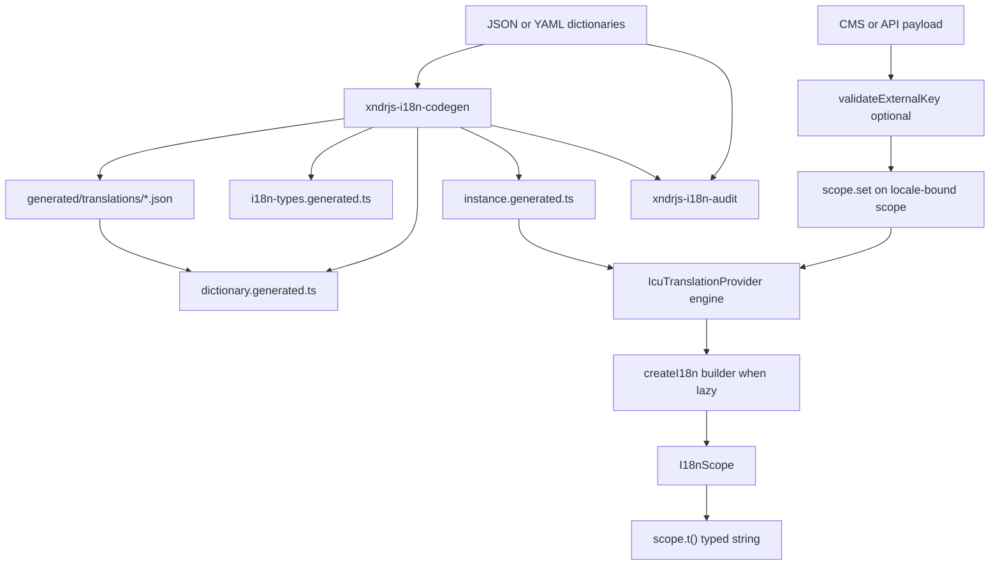

`@xndrjs/i18n` is a **compiler-first, type-safe i18n system** based on [ICU MessageFormat](https://formatjs.github.io/docs/core-concepts/icu-syntax/). Local dictionary files (JSON or YAML) act as **typed fallbacks**; a build-time codegen step parses ICU templates and generates exact TypeScript types for keys and parameters. At runtime, a shared **engine** caches compiled messages; the **builder** loads lazy artifacts; **scopes** expose typed `t()` and locale-bound `set()` for CMS patches.

For motivation, design trade-offs, and split-by-locale delivery, see [Type-safe i18n and flexible delivery](/blog/type-safe-i18n-with-flexible-delivery/).



## In this section

| Page                                                            | Topics                                                     |
| --------------------------------------------------------------- | ---------------------------------------------------------- |
| [Dictionaries](/v0/infrastructure/i18n/dictionaries/)           | JSON shape, YAML authoring, serving from `public/`         |
| [Delivery](/v0/infrastructure/i18n/delivery/)                   | Canonical, split-by-locale, custom areas                   |
| [Codegen](/v0/infrastructure/i18n/codegen/)                     | ICU inference, generated files, single vs multi            |
| [Runtime](/v0/infrastructure/i18n/runtime/)                     | Engine, scopes, builder, `scope.set()`, load deduplication |
| [Locale fallback](/v0/infrastructure/i18n/locale-fallback/)     | Fallback chains, locale projection helpers                 |
| [Lazy loading](/v0/infrastructure/i18n/lazy-loading/)           | `loadOnInit`, namespace loaders, builder `load()`          |
| [External validation](/v0/infrastructure/i18n/validation/)      | CMS/API payloads before `scope.set()`                      |
| [Configuration](/v0/infrastructure/i18n/configuration/)         | `i18n.codegen.json` reference                              |
| [Errors & exports](/v0/infrastructure/i18n/errors-and-exports/) | Error prefixes, package exports                            |

## Install

```bash
pnpm add @xndrjs/i18n zod
pnpm add -D tsx
```

| Dependency     | Role                                                                                                                                 |
| -------------- | ------------------------------------------------------------------------------------------------------------------------------------ |
| `@xndrjs/i18n` | Runtime providers, validation helpers, codegen CLI (`xndrjs-i18n-codegen`), audit CLI (`xndrjs-i18n-audit`)                          |
| `tsx`          | **Peer dependency** (dev) — codegen and audit CLIs run TypeScript directly                                                           |
| `zod`          | **Peer dependency** — validates `i18n.codegen.json`; also powers `validateExternalDictionary()` when `dictionarySchemaOutput` is set |

Production bundles depend on `@xndrjs/i18n` and `intl-messageformat` (pulled in by the package). Codegen runs at build time only.

## Scaffold and codegen

### Setup CLI

```bash
pnpm --filter YourPackageOrAppName exec xndrjs-i18n-setup single . --project MyApp
pnpm --filter YourPackageOrAppName exec xndrjs-i18n-setup multi apps/myapp --project MyApp
```

This creates under the target directory (for example `i18n/` or `src/i18n/`):

- `i18n.codegen.json`
- starter translation files (JSON by default; YAML supported)
- `index.ts` exporting `createI18n(dictionary)` and generated types

Pass `src` as the target when your app uses a `src/` layout.

### Codegen script

Add to `package.json`:

```json
{
  "scripts": {
    "i18n:codegen": "xndrjs-i18n-codegen --config i18n/i18n.codegen.json",
    "i18n:audit": "xndrjs-i18n-audit --config i18n/i18n.codegen.json"
  }
}
```

Run after every change to translation files (JSON or YAML) — or wire into your build:

```bash
pnpm --filter YourPackageOrAppName run i18n:codegen
```

Default config path is `i18n/i18n.codegen.json`. Paths inside the config are relative to the directory containing that file.

### Audit script

```bash
# Report to stdout (exit 0 even when gaps exist)
pnpm --filter YourPackageOrAppName exec xndrjs-i18n-audit --config i18n/i18n.codegen.json

# Write the same JSON report to a file
pnpm --filter YourPackageOrAppName exec xndrjs-i18n-audit --config i18n/i18n.codegen.json --out audit.json

# CI gate: exit 1 when runtime would still miss strings after fallback
pnpm --filter YourPackageOrAppName exec xndrjs-i18n-audit --config i18n/i18n.codegen.json --fail-on effective
```

| Flag                                   | Purpose                                                                                                                                                                                                     |
| -------------------------------------- | ----------------------------------------------------------------------------------------------------------------------------------------------------------------------------------------------------------- |
| `--config <path>`                      | Path to `i18n.codegen.json` (default: `i18n/i18n.codegen.json` relative to cwd).                                                                                                                            |
| `--out <path>`                         | Write the JSON report to a file instead of stdout.                                                                                                                                                          |
| `--fail-on effective \| direct \| any` | Optional. Without it, the CLI always exits `0` (report-only). With it, exits `1` when gaps remain: `effective` = `t()` would throw; `direct` = no string in the dictionary for that locale; `any` = either. |
| `--allow-empty`                        | Treat `""` as a valid template (default: empty strings count as missing).                                                                                                                                   |

Produces a JSON report of missing translations per namespace and locale. **`requiredLocales`** are all locales your i18n instance can use.

| Report field               | Meaning                                                                                                                                              |
| -------------------------- | ---------------------------------------------------------------------------------------------------------------------------------------------------- |
| `missingDirectByLocale`    | The key has no string for that locale in the dictionary. Often fine at runtime if fallback supplies another locale — mainly a translator to-do list. |
| `missingEffectiveByLocale` | No string for that locale, and fallback cannot find one either. `t()` would throw — fix before shipping.                                             |

When `localeFallback` is set in config, codegen enriches generated `LOCALE_FALLBACK` with `[locale]: null` for every `MyProjectLocale` not explicitly configured (runtime unchanged).

## See also

- [Type-safe i18n and flexible delivery](/blog/type-safe-i18n-with-flexible-delivery/) — motivation, design, and delivery
- [Package map](/v0/reference/package-map/) — where this package fits
- [Demo app in the monorepo](https://github.com/xndrjs/toolkit/tree/main/apps/i18n-demo) — single and multi examples
- [README in the monorepo](https://github.com/xndrjs/toolkit/tree/main/packages/i18n) — full reference when working on the package itself
