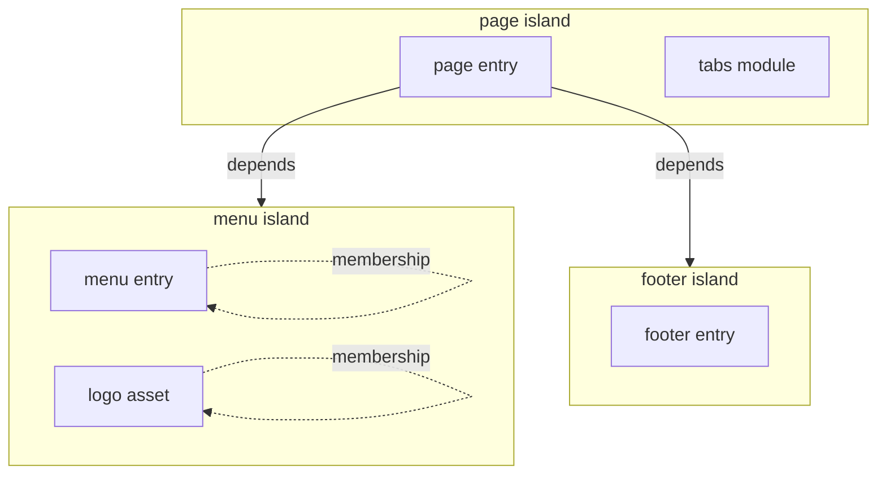
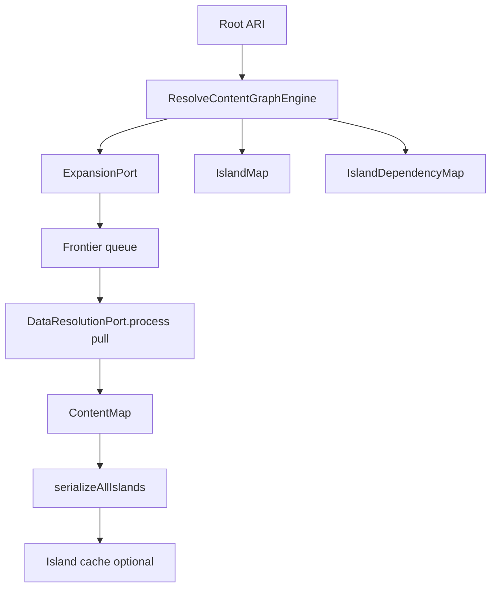

`@xndrjs/resource-graph-resolver` resolves a **content resource graph** from a root [Application Resource Identifier](/v0/application/application-resources/) (ARI). It walks child resources discovered by your expansion rules, loads payloads through a pull-based data port, tracks **island** membership and **dependencies**, and returns a typed `ContentMap` you can serialize for cache or map into domain aggregates.

## What is an island?

An **island** is a **subgraph of the resolution walk** that has its **own identity** in the graph — a unit you treat as distinct from the island that reached it. You declare that identity in your expansion policy with `isIsland: true` on a resolved resource. That resource’s ARI (`resource.toString()`) becomes the island **id**; every resource reached while expanding from that point — until the next `isIsland` boundary — **belongs** to the same island.

Typical reasons to mark an island: a fragment with a **different lifecycle** than its parent (global header, shared footer, ...), a **reusable slice** referenced from multiple places, or a boundary where **membership** should not collapse into the parent’s aggregate.

In practice:

- The **root** of a resolve starts as an island (its own id).
- When expansion returns `isIsland: true`, traversal **forks**: the resource starts a new island; its parent records a **dependency** on it.
- Each island is a first-class node in the output (`IslandMap`, `SerializedIsland`) — cache TTL, warm paths, and invalidation are **downstream** concerns your infrastructure may attach to that model; they are not what defines an island.

**Membership** (which resources live inside an island) and **dependencies** (which other islands one island needs) are separate:

| Concept        | Meaning                                                                |
| -------------- | ---------------------------------------------------------------------- |
| **Membership** | Resources assigned to this island during traversal                     |
| **Dependency** | Direct edge to a child island created by `isIsland: true` on expansion |

Example: a page island may **depend on** `menu` and `footer` islands without **containing** their payloads. The page’s direct dependencies are only its immediate island children; `getFlatDependencies(page)` adds transitive ones when nested islands exist deeper in the graph.



Islands let you **name and partition** a large graph by application meaning — what is “the page”, what is “the menu”, what is shared — before you decide how to cache, invalidate, or aggregate each part. The demo app shows one possible downstream use (tiered LRU + manifests); the engine only tracks identity, membership, and dependencies.

The engine is **schema-agnostic**: you supply a `ContentRegistry` (ARI `type` → payload shape), `DataResolutionPort`, and `ExpansionPort`. Frameworks, CMS clients, and cache stores stay in your infrastructure layer.

For a full wiring example, see the [`resource-graph-resolver-demo`](https://github.com/xndrjs/toolkit/tree/main/apps/resource-graph-resolver-demo) app (`src/orchestration/resolve-demo-page.ts` composes loaders, expansion policies, island cache, and domain mappers).



## Where it fits

| Layer              | Responsibility                                                               |
| ------------------ | ---------------------------------------------------------------------------- |
| **Application**    | ARIs, use-case orchestration, domain mapping from `ContentMap`               |
| **Infrastructure** | CMS/integration loaders, expansion policies, island cache adapters           |
| **This package**   | Reusable graph traversal, island semantics, serialization — no IO of its own |

Pair with [`@xndrjs/contentful-to-zod`](/v0/infrastructure/contentful-to-zod/) for typed Contentful payloads and link-field metadata when authoring expansion policies.

## Install

```bash
pnpm add @xndrjs/resource-graph-resolver @xndrjs/application-resources
```

## ContentRegistry and ContentMap

Define which ARI `type` literals your project resolves and what each payload looks like:

```ts
import type { ContentRegistry } from "@xndrjs/resource-graph-resolver";

type DemoContentRegistry = {
  "cms.entry": ContentfulResolvedEntry;
  "cms.asset": ContentfulAsset;
  "integration.product": ProductDto;
} & ContentRegistry;
```

`ContentMap<R>` keys entries by `resource.toString()` (canonical ARI identity). `get(resource)` narrows the return type from `resource.type`; `getByKey` stays weakly typed for cache and JSON paths.

## ResolveContentGraphEngine

Construct the engine with two ports, then execute from a root ARI:

```ts
import { ResolveContentGraphEngine } from "@xndrjs/resource-graph-resolver";

const engine = new ResolveContentGraphEngine<DemoContentRegistry, DemoExecutionContext>(
  dataGateway,
  expansionPort
);

const output = await engine.execute({
  root: pageRoot,
  executionContext: { locale: "en-US" },
  missingResourceMode: "throw", // or "collect"
});
```

`execute` returns:

| Field                | Role                                                               |
| -------------------- | ------------------------------------------------------------------ |
| `contentMap`         | Resolved payloads keyed by ARI                                     |
| `islands`            | Per-island resource membership                                     |
| `islandDependencies` | Direct edges between islands (child island promoted by `isIsland`) |
| `errors`             | Missing resources when `missingResourceMode: "collect"`            |

### Optional backing cache

Pass `resolvedResourceCache: Map<ResourceKey, unknown>` to hydrate hits **before** the data port runs. The engine promotes matching frontier items into `ContentMap` and removes them from the map (pass a mutable `Map` when you want promotion counts). Use this for partial warm paths — for example dependency islands still valid while the page island expired.

## DataResolutionPort (pull model)

Loaders implement `process({ take })`. The engine calls `take(accept, limit?)` to select unresolved frontier resources; your adapter batches fetches and returns `Map<ResourceKey, payload>`.

```ts
import { createDataResolutionPull, type DataResolutionPort } from "@xndrjs/resource-graph-resolver";

// Inside your loader:
async process(pull) {
  const batch = pull.take((resource) => cmsEntryAri.matches(resource));
  // fetch batch, return Map<resourceKey, payload>
}
```

Compose multiple sources (CMS + integration API) by merging pull results in one gateway — see the demo's `createDemoDataGateway`.

## ExpansionPort and policies

Expansion discovers **child ARIs** and optional **island boundaries** for an already-resolved resource.

Author policies with `defineExpansionPolicy` and chain them with `createExpansionPolicyChain` (first match wins):

```ts
import { createExpansionPolicyChain, defineExpansionPolicy } from "@xndrjs/resource-graph-resolver";
import { cmsEntryAri } from "./cms/ari";

export const expansionPort = createExpansionPolicyChain([
  defineExpansionPolicy({
    for: cmsEntryAri,
    when: ({ resource, executionContext }) => resource.key[0].locale === executionContext.locale,
    expand: ({ resource, contentMap }) => {
      const entry = contentMap.get(resource);
      if (!entry) return { resources: [] };

      return {
        resources: collectChildArisFromEntry(entry),
        isIsland: entry.sys.contentType.sys.id === "menu",
      };
    },
  }),
]);
```

When `isIsland: true`, the resource becomes a new island id (`resource.toString()`). The parent island records a **direct dependency** on that child island. Children discovered from the new island inherit its id until another `isIsland` boundary appears.

**Dependencies ≠ membership.** A child island is a dependency of its parent, not necessarily a direct dependency of the page root — but nested islands appear in the transitive flat closure (below). Resources such as a `logo` asset resolved **inside** the menu island are **members** of that island, not separate islands, unless expansion marks them with `isIsland: true`.

## IslandDependencyMap

After resolution, inspect direct and transitive island edges:

```ts
const pageId = pageRoot.toString();

output.islandDependencies.get(pageId); // direct child islands only
output.islandDependencies.getFlatDependencies(pageId); // transitive, deduped, sorted
output.islandDependencies.dependencyMap; // snapshot ReadonlyMap of all direct edges
```

Use `getFlatDependencies` when you need the full transitive dependency closure from a root island (for example a manifest of every dependency island reachable from a page).

## Serialization

Materialize portable island payloads for JSON or LRU cache:

```ts
import { serializeIsland, serializeAllIslands } from "@xndrjs/resource-graph-resolver";

const islands = serializeAllIslands(output);
const pageIsland = serializeIsland(pageRoot.toString(), output);
```

Each `SerializedIsland` (schema v1) includes:

- `resources` — payloads for members of that island (not dependency-only roots)
- `dependencies` — **direct** child island ids from `IslandDependencyMap`
- `completeness` — `"complete"` or `"partial"` when errors inherited this island
- `missingResources` — unresolved keys attributed to this island

`buildResolvedResourceCacheFromIslands` reverses complete islands back into a backing map for the next `execute` call.

## Typical project wiring

1. **ARIs** — one factory per source/type (`cms.entry`, `cms.asset`, …).
2. **ContentRegistry** — union of resolved payload types.
3. **DataResolutionPort** — per-source loaders composed into a gateway.
4. **ExpansionPort** — content-type or resource-family policies; `isIsland` where a fragment has its own identity or lifecycle.
5. **Orchestration** — load backing → `execute` → map `ContentMap` to domain → `serializeAllIslands` → persist to cache.
6. **Domain mappers** — stay outside this package; consume `ResolveContentGraphOutput`.

## API

Exported symbols:

- **`ResolveContentGraphEngine`**
- **`ContentMap`**
- **`IslandMap`** / **`IslandDependencyMap`**
- **`createExpansionPolicyChain`** / **`defineExpansionPolicy`**
- **`createDataResolutionPull`** / **`DataResolutionPort`**
- **`serializeIsland`** / **`serializeAllIslands`**
- **`buildResolvedResourceCacheFromIslands`**
- Types: **`ContentRegistry`**, **`SerializedIsland`**, **`ExpansionPort`**, **`ExpansionResult`**, **`ResolveContentGraphInput`**, **`ResolveContentGraphOutput`**, **`ResourceKey`**, **`IslandId`**

## See also

- [Application resources](/v0/application/application-resources/) — ARI factories and `toString()` keys used throughout the engine
- [Contentful to Zod](/v0/infrastructure/contentful-to-zod/) — transport schemas and link-field metadata for expansion authoring
- [Demo app README](https://github.com/xndrjs/toolkit/tree/main/apps/resource-graph-resolver-demo)
