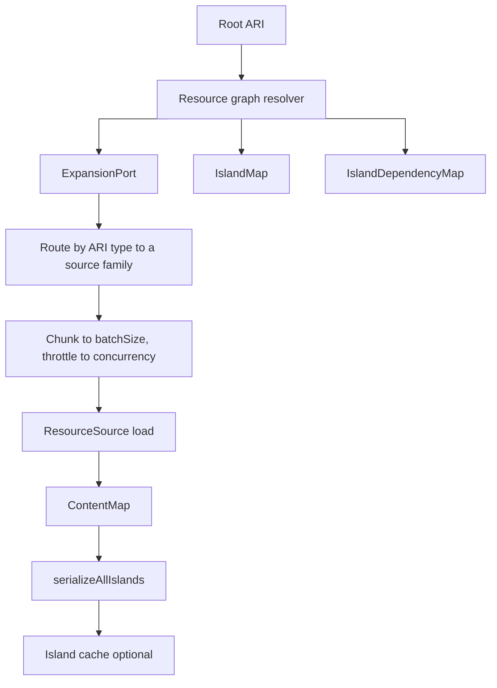

`@xndrjs/resource-graph-resolver` resolves a **resource graph** from a root [Application Resource Identifier](/v0/application/application-resources/) (ARI). It walks child resources discovered by your expansion rules, loads payloads through the backends you declare, tracks **island** membership and **dependencies**, and returns a typed `ContentMap` you can serialize for cache or map into domain aggregates.

### What is an island?

An **island** is a **subgraph of the resolution walk** that has its **own identity** in the graph — a unit you treat as distinct from the island that reached it. You declare that identity in your expansion policy with `isIsland: true` on a resolved resource. That resource’s ARI (`resource.toString()`) becomes the island **id**; every resource reached while expanding from that point — until the next `isIsland` boundary — **belongs** to the same island.

Typical reasons to mark an island: a fragment with a **different lifecycle** than its parent (global header, shared footer, …), a **reusable slice** referenced from multiple places, or a boundary where **membership** should not collapse into the parent’s aggregate.

In practice:

- The **root** of a resolve starts as an island (its own id).
- When expansion returns `isIsland: true`, traversal **forks**: the resource starts a new island; its parent records a **dependency** on it.
- Each island is a first-class node in the output (`IslandMap`, `SerializedIsland`) — cache TTL, warm paths, and invalidation are **downstream** concerns your infrastructure may attach to that model; they are not what defines an island.

**Membership** (which resources live inside an island) and **dependencies** (which other islands one island needs) are separate:

| Concept        | Meaning                                                                |
| -------------- | ---------------------------------------------------------------------- |
| **Membership** | Resources assigned to this island during traversal                     |
| **Dependency** | Direct edge to a child island created by `isIsland: true` on expansion |

Example: a page island may **depend on** `menu` and `footer` islands without **containing** their payloads. The page’s direct dependencies are only its immediate island children; `getFlatDependencies(page)` adds transitive ones when nested islands exist deeper in the graph.

Islands let you **name and partition** a large graph by application meaning — what is “the page”, what is “the menu”, what is shared — before you decide how to cache, invalidate, or aggregate each part. The demo app shows one possible downstream use (tiered LRU + manifests); the resolver only tracks identity, membership, and dependencies. It does **not** invalidate caches for you.

Islands are meant for **macro-grouping**. A resource reachable from many islands is tracked in all of them, so marking hundreds of fine-grained islands over a shared subgraph multiplies membership entries — model islands around lifecycle boundaries, not around individual nodes.

The resolver is **schema-agnostic**: you supply a `ContentRegistry` (ARI `type` → payload shape), one `ResourceSource` per backend, and an `ExpansionPort`. Frameworks, CMS clients, and cache stores stay in your infrastructure layer.

For a full wiring example, see the [`resource-graph-resolver-demo`](https://github.com/xndrjs/toolkit/tree/main/apps/resource-graph-resolver-demo) app: `demo-resolver.ts` wires sources and expansion once; `resolveDemoPage` is the single integration path (defaults to `lane`; flip `DEMO_STRATEGY` in that file to try `barrier`). Timed lane-vs-barrier comparisons live in `@xndrjs/resource-graph-resolver-bench`.



## Where it fits

The resolver sits in **infrastructure** because the split between external systems (CMS, commercial API, …) is an infrastructure concern. The application asks for a domain aggregate; it should not have to know how that aggregate is assembled from backends.

[Application Resource Identifiers](/v0/application/application-resources/) still provide the identity vocabulary — but the ARIs that name nodes in **this** graph (`cms.entry`, `integration.product`, …) are **infrastructure resources**. Infrastructure may know where a product lives today; the domain should not. Mapping from the resolved `ContentMap` into domain shapes happens above this package:

```text
Transport
   ↓
Infrastructure resources (ARIs)
   ↓
Graph resolution (this package)
   ↓
Domain aggregate
   ↓
UI / framework
```

Pair with [`@xndrjs/contentful-to-zod`](/v0/infrastructure/contentful-to-zod/) for typed Contentful payloads and link-field metadata when authoring expansion policies.

## Install

```bash
pnpm add @xndrjs/resource-graph-resolver @xndrjs/application-resources
```

## ContentRegistry and ContentMap

Define which ARI `type` literals your project resolves and what each payload looks like:

```ts
type CmsContentRegistry = {
  "cms.entry": ContentfulResolvedEntry;
  "cms.asset": ContentfulAsset;
};

type IntegrationContentRegistry = {
  "integration.product": ProductDto;
};
```

Compose the project registry from per-source slices. Use `ComposeContentRegistry` so hovers and type errors show one flat object rather than a chain of intersections:

```ts
import type { ComposeContentRegistry } from "@xndrjs/resource-graph-resolver";

type DemoContentRegistry = ComposeContentRegistry<[CmsContentRegistry, IntegrationContentRegistry]>;
```

Do **not** intersect with `ContentRegistry` itself (`{ ... } & ContentRegistry`): `ContentRegistry` is `Record<string, unknown>`, so intersecting widens `keyof` back to `string` and payload narrowing collapses. `ContentRegistry` is a **constraint**, not a base type to mix in.

`ContentMap<R>` keys entries by `resource.toString()` (canonical ARI identity). `get(resource)` narrows the return type from `resource.type`; `getByKey` stays weakly typed for cache and JSON paths. It also exposes `size`, `keys()`, `entries()`, iteration, and `toJSON()`.

## ResourceSource

A **source** is one backend plus the ARI **families** it owns. It declares the families (which drive both routing and narrowing), the backend's per-family batch limit, and how many requests that backend tolerates in parallel:

```ts
import { defineResourceSourceFor } from "@xndrjs/resource-graph-resolver";

const defineSource = defineResourceSourceFor<DemoContentRegistry, DemoExecutionContext>();

export const cmsSource = defineSource({
  id: "cms",
  families: { entry: cmsEntryAri, asset: cmsAssetAri },
  batchSize: { entry: 100, asset: 100 },
  async load({ entry, asset }, { signal }) {
    // entry: readonly CmsEntryResource[]
    // asset: readonly CmsAssetResource[]
    const [entries, assets] = await Promise.all([
      fetchEntries(entry, signal),
      fetchAssets(asset, signal),
    ]);

    return [...entries, ...assets];
  },
});
```

The definer is curried (`defineResourceSourceFor<R, Ctx>()` then the config) because TypeScript has no partial type-argument inference: currying keeps `families` inferred while the registry stays explicit.

`R` is the **whole project registry**, not the source's own slice — payload shapes are a project-wide contract, and `families` is what scopes a source to the ARI types it may be asked for and may return. Returning a record outside the declared families is a compile error.

| Field         | Meaning                                                                   |
| ------------- | ------------------------------------------------------------------------- |
| `id`          | Stable identifier used in observer events and error messages              |
| `families`    | ARI factories this source owns; each family covers exactly one ARI `type` |
| `batchSize`   | Max ARIs per family in one `load`. Omit a family for “no limit”           |
| `concurrency` | Loads this backend tolerates in parallel. Defaults to `1` (serial)        |
| `load`        | Fetch one batch and return correlated `{ resource, payload }` records     |

### Who owns what

The resolver owns **routing** (by ARI `type`, then family `matches`), **chunking** to `batchSize`, **throttling** to `concurrency`, **scheduling**, deduplication and island bookkeeping. A source owns one backend's transport — and its retry/backoff policy: a source has at most `concurrency` loads in flight, so awaiting inside `load` throttles that backend and nothing else.

A source signals “no data” by **omitting** an ARI from its result. Never throw for a single missing row: a rejected `load` fails the whole batch.

### Cancellation inside a source

`load` receives the resolution's `signal`. Forward it into `fetch` (or your client's equivalent) so an aborted resolution cancels in-flight IO instead of merely ignoring the result:

```ts
load: ({ product }, { signal }) =>
  fetch(url, { method: "POST", body: JSON.stringify({ skus }), signal }),
```

## Resolver and strategies

Build one resolver per source topology and reuse it across requests:

```ts
import { createResourceGraphResolver } from "@xndrjs/resource-graph-resolver";

const resolver = createResourceGraphResolver<DemoContentRegistry, DemoExecutionContext>({
  sources: [cmsSource, integrationSource],
  expansion: expansionPort,
  strategy: "lane", // or "barrier"
  observer, // optional
});

const output = await resolver.resolve({
  root: pageRoot,
  executionContext: { locale: "en-US" },
  missingResourceMode: "throw", // or "collect"
  // backingResources: cachedPayloadsByKey,
  // signal: AbortSignal.timeout(5_000),
});
```

Both strategies produce **identical** graph output — same `ContentMap`, island membership, dependencies, promotions and errors. They differ only in when expansion runs relative to in-flight loads:

| Strategy  | Scheduler                                                              | When to prefer                                                              |
| --------- | ---------------------------------------------------------------------- | --------------------------------------------------------------------------- |
| `lane`    | Expand as soon as **any** batch commits; sources advance independently | Uneven backend latency: a fast CMS should not wait on a slow commercial API |
| `barrier` | Wait for **every** in-flight batch, then expand together               | Reproducible rounds for tracing and tests; backends of similar latency      |

Under `lane`, a fast source keeps walking its own subgraph while a slow peer's request is still open, so wall clock stops tracking the slowest backend in every wave.

When several sources declare the same ARI `type`, the first whose family `matches` the ARI wins; callers guarantee exactly one meaningful owner per ARI.

`resolve` returns:

| Field                  | Role                                                             |
| ---------------------- | ---------------------------------------------------------------- |
| `contentMap`           | Resolved payloads keyed by ARI                                   |
| `islands`              | Per-island resource membership                                   |
| `islandDependencies`   | Direct edges between islands (child island opened by `isIsland`) |
| `errors`               | Missing resources when `missingResourceMode: "collect"`          |
| `promotedResourceKeys` | Backing keys the walk actually reached, in promotion order       |

### Missing resources and termination

Because the resolver owns chunking, a batch always starts while work is pending and concurrency allows. So there is no ambiguous “no progress” state, and exactly three things can go wrong:

| Situation                                    | `"throw"`                 | `"collect"`                                                |
| -------------------------------------------- | ------------------------- | ---------------------------------------------------------- |
| A source omitted a requested ARI             | `MissingResourceError`    | Error entry attributed to every island that reached it     |
| No source declares a family matching the ARI | `NoResourceSourceError`   | Error entry (this is a wiring bug, not missing data)       |
| A source's `load` rejected                   | `ResourceLoadFailedError` | Error entries for that batch; other sources keep resolving |

All of them extend `ResourceGraphError`. `ResourceLoadFailedError` carries `sourceId`, `resourceKeys` and the original rejection as `cause`.

### Cancellation

Pass `signal: AbortSignal` on the resolve input. The resolver checks it around every load and forwards it to sources. Abort throws `ResourceGraphAbortedError` independent of `missingResourceMode`, and outstanding loads are always observed first, so a cancellation never leaves unhandled rejections behind.

### Optional backing resources

Pass `backingResources: ReadonlyMap<ResourceKey, unknown>` to hydrate hits **before** any source is asked. A backing entry is promoted the moment the walk reaches that ARI, so unreached keys cost nothing. The map is **never mutated**; the keys actually promoted come back as `promotedResourceKeys`. Use this for partial warm paths — for example dependency islands still valid while the root island expired.

## Observability

Pass an optional `observer` to trace batches, expansions and promotions without wrapping your sources or policies:

```ts
const observer: ResolutionObserver = {
  onBatchStart: ({ sourceId, batchNumber, resourceCount }) => {
    /* … */
  },
  onBatchEnd: ({ sourceId, durationMs, resolvedCount }) => {
    /* … */
  },
  onExpand: ({ resource, islandId, isIsland, children }) => {
    /* … */
  },
  onBackingPromote: ({ resource, islandIds }) => {
    /* … */
  },
  onMissingResource: ({ resourceKey, message }) => {
    /* … */
  },
};
```

Every hook is optional, and a hook that throws never affects resolution — observers are diagnostics, so a logging bug cannot corrupt a walk.

## ExpansionPort and policies

Expansion discovers **child ARIs** and optional **island boundaries** for an already-resolved resource.

**Expansion = current resource + its own payload + execution context.** A policy cannot look up other nodes in a shared map, cannot see the island it was reached from, and must not depend on which peers happened to land in the same batch. That constraint is what keeps expansion deterministic: the edges of the graph depend on content, not on traversal order or batch sizes.

Author policies with `defineExpansionPolicy` and chain them with `createExpansionPolicyChain` (first match wins):

```ts
import { createExpansionPolicyChain, defineExpansionPolicy } from "@xndrjs/resource-graph-resolver";
import { cmsEntryAri } from "./cms/ari";

export const expansionPort = createExpansionPolicyChain([
  defineExpansionPolicy({
    for: cmsEntryAri,
    when: ({ resource, executionContext }) => resource.key[0].locale === executionContext.locale,
    expand: ({ payload, executionContext }) => {
      return {
        resources: collectChildArisFromEntry(payload, executionContext.locale),
        isIsland: payload.sys.contentType.sys.id === "menu",
      };
    },
  }),
]);
```

`defineExpansionPolicy({ for })` narrows **both** `resource` and `payload` to the matched ARI family.

When `isIsland: true`, the resource becomes a new island id (`resource.toString()`). The parent island records a **direct dependency** on that child island. Children discovered from the new island inherit its id until another `isIsland` boundary appears.

**Dependencies ≠ membership.** A child island is a dependency of its parent, not necessarily a direct dependency of the page root — but nested islands appear in the transitive flat closure (below). Resources resolved **inside** an island are **members** of that island, not separate islands, unless expansion marks them with `isIsland: true`.

A resource reachable from several islands is expanded once per island, so it joins the membership of all of them while being fetched only once.

## IslandDependencyMap

After resolution, inspect direct and transitive island edges:

```ts
const pageId = pageRoot.toString();

output.islandDependencies.get(pageId); // direct child islands only
output.islandDependencies.getFlatDependencies(pageId); // transitive, deduped, sorted
output.islandDependencies.snapshot(); // copy of every direct edge
```

`snapshot()` is a method, not a getter, because its cost is proportional to islands × edges.

Use `getFlatDependencies` when you need the full transitive dependency closure from a root island (for example a manifest of every dependency island reachable from a page). The starting island is never included, even if dependency cycles point back to it.

## Serialization

Materialize portable island payloads for JSON or LRU cache:

```ts
import { serializeIsland, serializeAllIslands } from "@xndrjs/resource-graph-resolver";

const islands = serializeAllIslands(output);
const pageIsland = serializeIsland(pageRoot.toString(), output);
```

Each `SerializedIsland` (schema v1) includes:

- `resources` — payloads for members of that island (not dependency-only roots)
- `dependencies` — **direct** child island ids from `IslandDependencyMap`
- `completeness` — `"complete"` or `"partial"` when errors inherited this island
- `missingResources` — unresolved keys attributed to this island

`buildBackingResourcesFromIslands` reverses complete islands back into backing resources for the next `resolve` call:

```ts
buildBackingResourcesFromIslands(islands, { policy, onResourceConflict });
```

`policy` controls which islands contribute resources (`only-complete` or `all`).

Two cached islands can legitimately hold the same `resourceKey` with **different** payloads — a shared logo cached at two different times, for example. The library does not pick a winner for you, because the right answer depends on your freshness model. `onResourceConflict` (required) is invoked with:

- `existing` / `existingIslandId` (already in the map)
- `incoming` / `incomingIslandId` (new island payload)

Return values:

- returning a value keeps that payload in `backingResources`
- returning `null` or `undefined` discards the key, so the walk re-loads it from its source
- throwing rejects the whole backing build

## Typical project wiring

1. **Infrastructure ARIs** — one factory per backend/type (`cms.entry`, `cms.asset`, `integration.product`, …), next to the sources that own them.
2. **ContentRegistry** — per-source slices composed with `ComposeContentRegistry`.
3. **Sources** — one `ResourceSource` per backend: families it owns, batch limits, concurrency, `load`.
4. **ExpansionPort** — content-type or resource-family policies; `isIsland` where a fragment has its own identity or lifecycle.
5. **Resolver** — one `createResourceGraphResolver` per topology, `strategy` chosen per route (or fixed to `lane`).
6. **Orchestration** — load backing → `resolve` (optional `signal`) → map `ContentMap` to domain → `serializeAllIslands` → persist to cache.
7. **Domain mappers** — stay outside this package; consume `ResolveResourceGraphOutput`.

## API

Exported symbols:

- **`createResourceGraphResolver`** — and types `ResourceGraphResolver`, `ResourceGraphResolverConfig`
- **`defineResourceSourceFor`** — and types `ResourceSource`, `ResourceSourceDefinition`, `ResourceFamily`, `ResourceFamilyMap`, `ResourceOfFamily`, `PendingResourceBatch`, `SourceResourceRecord`, `ResourceBatchSizeMap`, `ResourceLoadContext`
- **`ContentMap`**, **`IslandMap`**, **`IslandDependencyMap`**
- **`createExpansionPolicyChain`** / **`defineExpansionPolicy`**
- **`serializeIsland`** / **`serializeAllIslands`** / **`buildBackingResourcesFromIslands`**
- Errors: **`ResourceGraphError`**, **`MissingResourceError`**, **`NoResourceSourceError`**, **`ResourceLoadFailedError`**, **`ResourceGraphAbortedError`**
- Observability: **`ResolutionObserver`** and its event types
- Types: **`ContentRegistry`**, **`ComposeContentRegistry`**, **`ResolveResourceGraphInput`**, **`ResolveResourceGraphOutput`**, **`ResolutionStrategy`**, **`ResolutionError`**, **`MissingResourceMode`**, **`SerializedIsland`**, **`ExpansionPort`**, **`ExpansionResult`**, **`ExpansionContext`**, **`ResolvedResourceRecord`**, **`ResourceKey`**, **`IslandId`**, **`RegistryPayloadFor`**

## See also

- [Application resources](/v0/application/application-resources/) — identity vocabulary (`toString()` keys); graph ARIs for this package are infrastructure-scoped factories
- [Contentful to Zod](/v0/infrastructure/contentful-to-zod/) — transport schemas and link-field metadata for expansion authoring
- [Demo app](https://github.com/xndrjs/toolkit/tree/main/apps/resource-graph-resolver-demo)
