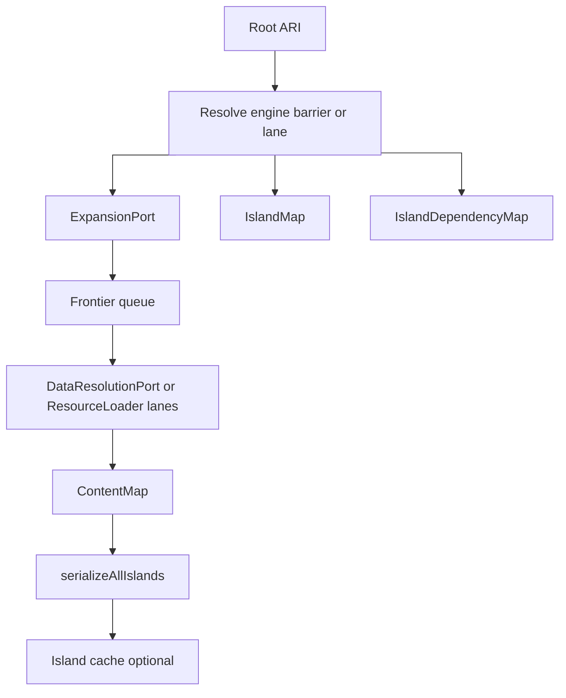

`@xndrjs/resource-graph-resolver` resolves a **content resource graph** from a root [Application Resource Identifier](/v0/application/application-resources/) (ARI). It walks child resources discovered by your expansion rules, loads payloads through a pull-based data port, tracks **island** membership and **dependencies**, and returns a typed `ContentMap` you can serialize for cache or map into domain aggregates.

### What is an island?

An **island** is a **subgraph of the resolution walk** that has its **own identity** in the graph — a unit you treat as distinct from the island that reached it. You declare that identity in your expansion policy with `isIsland: true` on a resolved resource. That resource’s ARI (`resource.toString()`) becomes the island **id**; every resource reached while expanding from that point — until the next `isIsland` boundary — **belongs** to the same island.

Typical reasons to mark an island: a fragment with a **different lifecycle** than its parent (global header, shared footer, …), a **reusable slice** referenced from multiple places, or a boundary where **membership** should not collapse into the parent’s aggregate.

In practice:

- The **root** of a resolve starts as an island (its own id).
- When expansion returns `isIsland: true`, traversal **forks**: the resource starts a new island; its parent records a **dependency** on it.
- Each island is a first-class node in the output (`IslandMap`, `SerializedIsland`) — cache TTL, warm paths, and invalidation are **downstream** concerns your infrastructure may attach to that model; they are not what defines an island.

**Membership** (which resources live inside an island) and **dependencies** (which other islands one island needs) are separate:

| Concept        | Meaning                                                                |
| -------------- | ---------------------------------------------------------------------- |
| **Membership** | Resources assigned to this island during traversal                     |
| **Dependency** | Direct edge to a child island created by `isIsland: true` on expansion |

Example: a page island may **depend on** `menu` and `footer` islands without **containing** their payloads. The page’s direct dependencies are only its immediate island children; `getFlatDependencies(page)` adds transitive ones when nested islands exist deeper in the graph.

Islands let you **name and partition** a large graph by application meaning — what is “the page”, what is “the menu”, what is shared — before you decide how to cache, invalidate, or aggregate each part. The demo app shows one possible downstream use (tiered LRU + manifests); the engine only tracks identity, membership, and dependencies. It does **not** invalidate caches for you.

The engine is **schema-agnostic**: you supply a `ContentRegistry` (ARI `type` → payload shape), `DataResolutionPort`, and `ExpansionPort`. Frameworks, CMS clients, and cache stores stay in your infrastructure layer.

For a full wiring example, see the [`resource-graph-resolver-demo`](https://github.com/xndrjs/toolkit/tree/main/apps/resource-graph-resolver-demo) app (`resolve-barrier-demo-page.ts` / `resolve-lane-demo-page.ts` compose loaders, expansion policies, island cache, and domain mappers).



## Where it fits

| Layer              | Responsibility                                                               |
| ------------------ | ---------------------------------------------------------------------------- |
| **Application**    | ARIs, use-case orchestration, domain mapping from `ContentMap`               |
| **Infrastructure** | CMS/integration loaders, expansion policies, island cache adapters           |
| **This package**   | Reusable graph traversal, island semantics, serialization — no IO of its own |

Pair with [`@xndrjs/contentful-to-zod`](/v0/infrastructure/contentful-to-zod/) for typed Contentful payloads and link-field metadata when authoring expansion policies.

## Install

```bash
pnpm add @xndrjs/resource-graph-resolver @xndrjs/application-resources
```

## ContentRegistry and ContentMap

Define which ARI `type` literals your project resolves and what each payload looks like:

```ts
import type { ContentRegistry } from "@xndrjs/resource-graph-resolver";

type DemoContentRegistry = {
  "cms.entry": ContentfulResolvedEntry;
  "cms.asset": ContentfulAsset;
  "integration.product": ProductDto;
} & ContentRegistry;
```

`ContentMap<R>` keys entries by `resource.toString()` (canonical ARI identity). `get(resource)` narrows the return type from `resource.type`; `getByKey` stays weakly typed for cache and JSON paths.

## Walk strategies

The package ships two engines with the **same** `execute` contract and graph semantics (backing promotion, `ContentMap`, island membership/dependencies, cycles, missing resources, cancellation). They differ only in **how the frontier is scheduled** across sources.

| Strategy    | Engine                             | Collaborator                                            | Scheduler                                                                                                                                                                                                                  |
| ----------- | ---------------------------------- | ------------------------------------------------------- | -------------------------------------------------------------------------------------------------------------------------------------------------------------------------------------------------------------------------- |
| **Barrier** | `BarrierResolveContentGraphEngine` | one `DataResolutionPort` (often a multi-source gateway) | Each round: call `process`, wait for the whole result, then expand. Inside a gateway, loaders may run in parallel, but the round still waits on the **slowest** peer.                                                      |
| **Lane**    | `LaneResolveContentGraphEngine`    | ordered `ResourceLoader[]`                              | Each loader is a **lane** with **exactly one** in-flight `process`. Different loaders may overlap; expand runs as soon as a lane’s batch commits. A fast lane may start its next batch while a slow lane is still pending. |

**Trade-offs**

- Prefer **barrier** when sources have similar latency, you already compose behind a gateway, or you want round-shaped traces and the simplest multi-source wiring.
- Prefer **lane** when one backend is routinely slower (for example CMS vs commercial API) and you want expand/enqueue to proceed per source instead of waiting on every wave’s slowest peer.
- Lane routing is **chain-of-responsibility**: first `accepts(resource)` wins; callers guarantee exactly one loader owns each ARI. Unmatched ARIs follow `missingResourceMode`.
- Do **not** overload `DataResolutionPort` for lane ownership — that port stays the barrier engine’s round collaborator. Use `ResourceLoader` (`accepts` + pull `process`) for lanes.

The demo exposes both: `/[locale]/barrier` (gateway) and `/[locale]/lane` (source loaders). Terminal traces label barrier rounds vs lane batches separately.

## BarrierResolveContentGraphEngine (barrier)

Construct the barrier engine with a data port and expansion port, then execute from a root ARI:

```ts
import { BarrierResolveContentGraphEngine } from "@xndrjs/resource-graph-resolver";

const engine = new BarrierResolveContentGraphEngine<DemoContentRegistry, DemoExecutionContext>(
  dataGateway,
  expansionPort
);

const output = await engine.execute({
  root: pageRoot,
  executionContext: { locale: "en-US" },
  missingResourceMode: "throw", // or "collect"
  // signal: AbortSignal.timeout(5_000),
});
```

## LaneResolveContentGraphEngine

Pass an ordered loader chain (not a gateway) plus the same `ExpansionPort`:

```ts
import {
  LaneResolveContentGraphEngine,
  type ResourceLoader,
} from "@xndrjs/resource-graph-resolver";

const loaders: readonly ResourceLoader<DemoContentRegistry>[] = [cmsLoader, integrationLoader];

const engine = new LaneResolveContentGraphEngine<DemoContentRegistry, DemoExecutionContext>(
  loaders,
  expansionPort
);

const output = await engine.execute({
  root: pageRoot,
  executionContext: { locale: "en-US" },
  missingResourceMode: "throw",
});
```

Each loader implements `accepts` for ownership and `process(pull)` with the same `take` batching model as the barrier port. Internal multi-family batching remains the loader’s concern; the engine only guarantees serial `process` calls **per** loader.

`execute` returns (both engines):

| Field                | Role                                                               |
| -------------------- | ------------------------------------------------------------------ |
| `contentMap`         | Resolved payloads keyed by ARI                                     |
| `islands`            | Per-island resource membership                                     |
| `islandDependencies` | Direct edges between islands (child island promoted by `isIsland`) |
| `errors`             | Missing resources when `missingResourceMode: "collect"`            |

### Missing resources and no-progress termination

- Resources **taken** by a loader/port but omitted from the result are missing (throw or collect).
- Resources **not taken** while at least one peer was taken stay deferred for a later round / lane pump after expand.
- If unresolved work remains and no eligible take / idle lane makes progress (`taken.length === 0` on barrier; every idle eligible lane took nothing on the lane engine), that is **no-progress**: the engine throws or collects every unhandled ARI via `missingResourceMode`. It is not treated as deferral.

### Cancellation

Pass `signal: AbortSignal` on `ResolveContentGraphInput` for cooperative cancellation; the engine checks the signal before and after every load. Lane mode still observes in-flight lane outcomes when one loader fails or the signal aborts.

Abort throws `ResolveContentGraphAbortedError`, independent of `missingResourceMode`.

### Optional backing resources

Pass `backingResources: Map<ResourceKey, unknown>` to hydrate hits **before** loaders run. The engine promotes matching frontier items into `ContentMap` and removes them from the map (pass a mutable `Map` when you want `backingResourceCount` / `promotedResourceCount`). Use this for partial warm paths — for example dependency islands still valid while the root island expired.

## DataResolutionPort (pull model)

Loaders implement `process({ take, signal? })`. The engine calls **`take(accept, limit?)`** to select unresolved frontier resources in order; your adapter batches fetches and returns correlated `{ resource, payload }` records.

- **`accept`** — predicate (optionally a type guard via `cmsEntryAri.matches`).
- **`limit`** (optional) — max resources to pull this round. Omit to take every match.
- Resources **not** pulled stay on the frontier; the engine expands what it has and calls `process` again — they are not missing errors.
- When **every** `take` in a `process` call returns empty, return `[]` immediately and **do not** perform IO.

```ts
import type { DataResolutionPort } from "@xndrjs/resource-graph-resolver";
import { cmsAssetAri, cmsEntryAri } from "./cms/ari";

const CMS_ENTRY_BATCH_SIZE = 10;
const CMS_ASSET_BATCH_SIZE = 10;

// Inside your CMS loader (same pattern as the demo):
async process(pull) {
  const entryBatch = pull.take(cmsEntryAri.matches, CMS_ENTRY_BATCH_SIZE);
  const assetBatch = pull.take(cmsAssetAri.matches, CMS_ASSET_BATCH_SIZE);

  if (entryBatch.length === 0 && assetBatch.length === 0) {
    return [];
  }

  const [entries, assets] = await Promise.all([
    fetchEntries(entryBatch),
    fetchAssets(assetBatch),
  ]);

  return [...entries, ...assets];
}
```

One `process` call can invoke `take` multiple times (per source or per resource family). Each `take` removes its batch from the frontier for that round only; if the frontier still has unresolved resources after expand, the engine schedules another round.

Compose multiple sources (CMS + integration API) for the **barrier** engine by merging pull results in one gateway — see the demo's `createDemoDataGateway` and `createCmsDataLoader`. Gateway composition is **barrier-based**: each round waits for all loaders before expand, so wall-clock time tracks the **slowest** backend in that wave.

For the **lane** engine, pass those same source adapters (with `accepts`) as an ordered `ResourceLoader` chain instead of wrapping them in a gateway — see [Walk strategies](#walk-strategies).

## ExpansionPort and policies

Expansion discovers **child ARIs** and optional **island boundaries** for an already-resolved resource.

**Expansion = current resource + current payload + execution context.** Policies must not look up other nodes in a shared map and must not depend on which peers happened to land in the same batch.

Author policies with `defineExpansionPolicy` and chain them with `createExpansionPolicyChain` (first match wins):

```ts
import { createExpansionPolicyChain, defineExpansionPolicy } from "@xndrjs/resource-graph-resolver";
import { cmsEntryAri } from "./cms/ari";

export const expansionPort = createExpansionPolicyChain([
  defineExpansionPolicy({
    for: cmsEntryAri,
    when: ({ resource, executionContext }) => resource.key[0].locale === executionContext.locale,
    expand: ({ payload, executionContext }) => {
      return {
        resources: collectChildArisFromEntry(payload, executionContext.locale),
        isIsland: payload.sys.contentType.sys.id === "menu",
      };
    },
  }),
]);
```

`defineExpansionPolicy({ for })` narrows **both** `resource` and `payload` to the matched ARI family. Because expansion never observes siblings, changing batch sizes does not change the edges a policy emits for a given node.

When `isIsland: true`, the resource becomes a new island id (`resource.toString()`). The parent island records a **direct dependency** on that child island. Children discovered from the new island inherit its id until another `isIsland` boundary appears.

**Dependencies ≠ membership.** A child island is a dependency of its parent, not necessarily a direct dependency of the page root — but nested islands appear in the transitive flat closure (below). Resources resolved **inside** an island are **members** of that island, not separate islands, unless expansion marks them with `isIsland: true`.

## IslandDependencyMap

After resolution, inspect direct and transitive island edges:

```ts
const pageId = pageRoot.toString();

output.islandDependencies.get(pageId); // direct child islands only
output.islandDependencies.getFlatDependencies(pageId); // transitive, deduped, sorted
output.islandDependencies.dependencyMap; // snapshot ReadonlyMap of all direct edges
```

Use `getFlatDependencies` when you need the full transitive dependency closure from a root island (for example a manifest of every dependency island reachable from a page). The starting island is never included, even if dependency cycles point back to it.

## Serialization

Materialize portable island payloads for JSON or LRU cache:

```ts
import { serializeIsland, serializeAllIslands } from "@xndrjs/resource-graph-resolver";

const islands = serializeAllIslands(output);
const pageIsland = serializeIsland(pageRoot.toString(), output);
```

Each `SerializedIsland` (schema v1) includes:

- `resources` — payloads for members of that island (not dependency-only roots)
- `dependencies` — **direct** child island ids from `IslandDependencyMap`
- `completeness` — `"complete"` or `"partial"` when errors inherited this island
- `missingResources` — unresolved keys attributed to this island

`buildBackingResourcesFromIslands` reverses complete islands back into backing resources for the next `execute` call:

```ts
buildBackingResourcesFromIslands(islands, { policy, onResourceConflict });
```

`policy` controls which islands contribute resources (`only-complete` or `all`).

When multiple included islands provide the same `resourceKey`, `onResourceConflict` (required) is invoked with:

- `existing` / `existingIslandId` (already in the map)
- `incoming` / `incomingIslandId` (new island payload)

Return values:

- returning a value keeps that payload in `backingResources`
- returning `null` or `undefined` discards the key (the engine will re-load it via the `DataResolutionPort`)
- throwing rejects the whole backing build

## Typical project wiring

1. **ARIs** — one factory per source/type (`cms.entry`, `cms.asset`, …).
2. **ContentRegistry** — union of resolved payload types.
3. **Loaders** — per-source adapters with pull `process` (and `accepts` for lane); compose into a gateway for barrier mode, or pass the ordered chain to the lane engine.
4. **ExpansionPort** — content-type or resource-family policies; `isIsland` where a fragment has its own identity or lifecycle.
5. **Orchestration** — choose barrier or lane → load backing → `execute` (optional `signal`) → map `ContentMap` to domain → `serializeAllIslands` → persist to cache.
6. **Domain mappers** — stay outside this package; consume `ResolveContentGraphOutput`.

## API

Exported symbols:

- **`BarrierResolveContentGraphEngine`** / **`LaneResolveContentGraphEngine`**
- **`ContentMap`**
- **`IslandMap`** / **`IslandDependencyMap`**
- **`createExpansionPolicyChain`** / **`defineExpansionPolicy`**
- **`createDataResolutionPull`** / **`DataResolutionPort`** / **`ResourceLoader`** / **`ResolvedResourceRecord`**
- **`serializeIsland`** / **`serializeAllIslands`**
- **`buildBackingResourcesFromIslands`**
- **`ResolveContentGraphAbortedError`**
- Types: **`ContentRegistry`**, **`SerializedIsland`**, **`ExpansionPort`**, **`ExpansionResult`**, **`ExpansionContext`**, **`ResolveContentGraphInput`**, **`ResolveContentGraphOutput`**, **`ResourceKey`**, **`IslandId`**, **`RegistryPayloadFor`**

## See also

- [Application resources](/v0/application/application-resources/) — ARI factories and `toString()` keys used throughout the engine
- [Contentful to Zod](/v0/infrastructure/contentful-to-zod/) — transport schemas and link-field metadata for expansion authoring
- [Demo app README](https://github.com/xndrjs/toolkit/tree/main/apps/resource-graph-resolver-demo)
