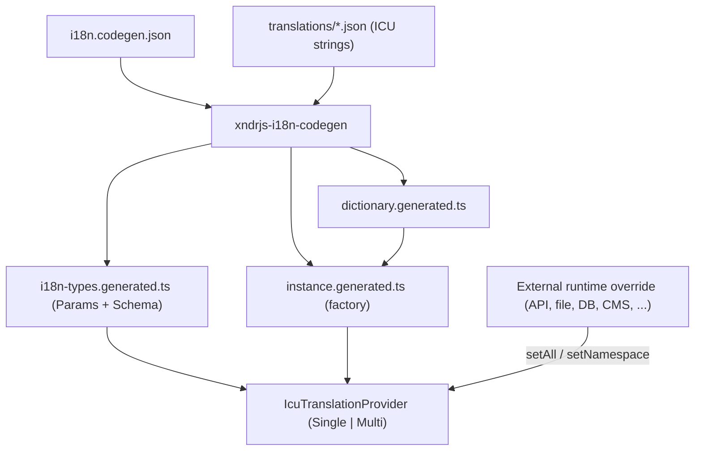

# @xndrjs/i18n

A **compiler-first, type-safe i18n system** based on the [ICU MessageFormat](https://formatjs.github.io/docs/core-concepts/icu-syntax/) standard, with **runtime dictionary overrides from external sources** (no rebuild required).

The core idea: your ICU strings live in local JSON files that act as **type-safe fallbacks**. A build-time codegen step parses the ICU AST and generates exact TypeScript types for every translation key and its parameters. At runtime, a centralized provider caches compiled messages and lets you replace the whole dictionary (or a single namespace) on the fly from any source (i.e. a CMS).

## Key features

- **Type-safe `.get()`** — the compiler knows exactly which parameters each key requires (`string`, `number`, or none).
- **ICU MessageFormat** — full support for interpolation, plurals, and select.
- **Runtime override** — hydrate translations from an external source via `setAll()` / `setNamespace()` without rebuilding.
- **Single-file or multi-namespace** — one flat dictionary, or multiple JSON files each bound to a namespace.
- **Lazy namespace loading** — optional code-splitting via `loadOnInit` and `ensureNamespacesLoaded()` (multi mode).
- **Hot compilation cache** — compiled `IntlMessageFormat` instances are cached and invalidated on override.
- **Explicit runtime errors** — malformed ICU (e.g. a corrupt remote payload) or missing parameters throw descriptive errors.
- **Publishable library** — the runtime and codegen live in a standalone package (`@xndrjs/i18n`) that carries no project-specific types.

## Getting started

### Install

```bash
npm install @xndrjs/i18n tsx
# optional — external dictionary validation
npm install zod
```

`tsx` is a **peer dependency** required by `xndrjs-i18n-codegen`: the CLI runs the TypeScript codegen script directly (no precompiled JS bundle). Add it to your app or monorepo root.

`zod` is optional — only needed when you use `dictionarySchemaOutput` and the generated `validateExternalDictionary()` helpers.

### Quick setup (single file)

**1. Translation JSON** (`src/i18n/translations/translations.json`):

```json
{
  "login_button": { "en": "Login", "it": "Accedi" },
  "welcome": { "en": "Welcome {name}!" }
}
```

**2. Codegen config** (`i18n.codegen.json` at project root):

```json
{
  "dictionary": "src/i18n/translations/translations.json",
  "typesOutput": "src/i18n/generated/i18n-types.generated.ts",
  "dictionaryOutput": "src/i18n/generated/dictionary.generated.ts",
  "instanceOutput": "src/i18n/generated/instance.generated.ts",
  "paramsTypeName": "MyProjectParams",
  "schemaTypeName": "MyProjectSchema"
}
```

**3. npm script** (`package.json`):

```json
{
  "scripts": {
    "i18n:codegen": "xndrjs-i18n-codegen --config i18n.codegen.json"
  }
}
```

**4. Generate and use:**

```bash
npm run i18n:codegen
```

```ts
// src/i18n/index.ts
import { createI18n } from "./generated/instance.generated.js";

export * from "./generated/instance.generated.js";
export * from "./generated/i18n-types.generated.js";

export const i18n = createI18n();
```

```ts
import { i18n } from "./i18n";

i18n.get("login_button", "it"); // "Accedi"
i18n.get("welcome", "en", { name: "Ada" }); // "Welcome Ada!"
```

Run codegen after every change to your JSON files (or wire it into your build).

Or scaffold the starter files with the setup CLI:

```bash
xndrjs-i18n-setup single . --project MyApp
xndrjs-i18n-setup multi apps/myapp --project MyApp
```

This creates `i18n.codegen.json`, starter translation JSON, and `src/i18n/index.ts`. Edit the config for lazy loading, validation, locale fallback, and extra namespaces, then run codegen.

### Quick setup (multi namespace)

Use `namespaces` instead of `dictionary` in `i18n.codegen.json`. See [Configuration](#configuration-i18ncodegenjson) and the [multi-namespace example](#multi-namespace-example) below.

For lazy loading, add `loadOnInit`, `dictionarySchemaOutput`, and `namespaceLoadersOutput` — see [Lazy namespace loading](#lazy-namespace-loading-multi-mode). Lazy mode requires `zod` (validation runs before a namespace is registered).

## Repository layout

This package lives in the xndrjs-toolkit pnpm monorepo.

```
xndrjs-toolkit/
├── packages/
│   └── i18n/                       # @xndrjs/i18n — the publishable library
│       ├── bin/
│       │   └── codegen.mjs         # CLI entry: xndrjs-i18n-codegen
│       └── src/
│           ├── index.ts            # public exports
│           ├── types.ts            # generic dictionary/cache types
│           ├── IcuTranslationProviderSingle.ts
│           ├── IcuTranslationProviderMulti.ts
│           └── codegen/
│               └── generate-i18n-types.ts
└── apps/
    └── i18n-demo/                  # @xndrjs/i18n-demo — workshop app
        ├── single/                 # single-file example
        │   ├── i18n.codegen.json
        │   └── src/i18n/
        └── multi/                  # multi-namespace example
            ├── i18n.codegen.json
            └── src/i18n/
```

### Library vs. consumer

`@xndrjs/i18n` is **generic** and never imports project-specific types. It exposes two provider classes parametrized by `Schema` and `Params` generics, plus the codegen CLI.

The consumer app owns its ICU JSON, its codegen config, and the generated files that bind the generic providers to concrete types.

## How it works



### 1. Source JSON

Each translation key maps locale codes to ICU strings. Structure is identical in both modes: `key -> locale -> ICU string`.

```json
{
  "login_button": { "it": "Accedi", "en": "Login" },
  "welcome": { "it": "Benvenuto {name}!", "en": "Welcome {name}!" },
  "dashboard_status": {
    "it": "Hai {msgCount, plural, one {1 messaggio} other {{msgCount} messaggi}} in {chatCount, plural, one {una chat} other {{chatCount} chat}}",
    "en": "You have {msgCount, plural, one {1 message} other {{msgCount} messages}} in {chatCount, plural, one {one chat} other {{chatCount} chats}}"
  }
}
```

### 2. Codegen (build-time)

`xndrjs-i18n-codegen` reads `i18n.codegen.json`, parses every ICU string with `@formatjs/icu-messageformat-parser`, and infers parameter types:

| ICU construct                             | Inferred type |
| ----------------------------------------- | ------------- |
| Simple argument `{name}`                  | `string`      |
| `plural` argument `{count, plural, ...}`  | `number`      |
| `select` argument `{gender, select, ...}` | `string`      |
| No variables                              | `never`       |

Variables found across **all locales** of the same key are merged. If parsing fails for any key/locale, codegen prints a contextual error and exits with a non-zero code (so it blocks CI/builds).

### 3. Generated files

- **`i18n-types.generated.ts`** — `I18N_MODE`, `MyProjectParams`, `MyProjectSchema`.
- **`dictionary.generated.ts`** — imports the JSON files and assembles the initial dictionary.
- **`instance.generated.ts`** — exports `createI18n()`, a typed factory with the default dictionary as fallback.
- **`i18n.ts`** (optional, hand-written) — app-owned singleton if desired.

Example generated types (multi-namespace):

```ts
export const I18N_MODE = "multi" as const;

export type MyProjectParams = {
  default: {
    login_button: never;
    welcome: { name: string };
    dashboard_status: { msgCount: number; chatCount: number };
  };
  user: {
    profile_title: never;
    greeting: { name: string };
  };
  billing: {
    invoice_summary: { count: number };
  };
};

export type MyProjectSchema = {
  default: typeof import("./translations/default.json");
  user: typeof import("./translations/user.json");
  billing: typeof import("./translations/billing.json");
};
```

### 4. Runtime provider

Create a provider with the generated factory (no side effects at import time):

```ts
import { createI18n } from "./i18n";

const i18n = createI18n();
// or with an external dictionary at init:
const i18n = createI18n(externalDictionary);
```

Optionally, wrap it in an app-owned singleton (`i18n.ts`):

```ts
import { createI18n } from "./instance.generated.js";
export const i18n = createI18n();
```

### Locale-bound provider (`forLocale`)

Bind a locale once and omit it on every `.get()`:

```ts
const i18n = createI18n();
const i18nEn = i18n.forLocale("en");

i18nEn.get("login_button"); // single-file
i18nEn.get("welcome", { name: "Ada" });

const i18nIt = i18n.forLocale("it");
i18nIt.get("default", "login_button"); // multi-namespace
i18nIt.get("billing", "invoice_summary", { count: 3 });
```

The bound view shares the parent dictionary, cache, and fallback rules. It exposes `locale` and a narrower `get()` signature only.

Because `Params[K]` (or `Params[NS][K]`) is used in a conditional rest parameter, TypeScript enforces the exact argument shape:

```ts
...params: Params[NS][K] extends never ? [] : [params: Params[NS][K]]
```

### 5. Locale fallback

When a translation is missing for the requested locale (`undefined` in the dictionary), the provider can walk a fallback chain before throwing. An empty string `""` is treated as a valid template and does **not** trigger fallback.

```json
"localeFallback": {
  "en": null,
  "de-DE": "en",
  "de-CH": "de-DE",
  "it": "en"
}
```

- `null` marks a terminal locale (no further fallback).
- Any other value is the next locale to try, recursively.
- If the chain ends without finding a template, `.get()` throws and includes the full chain in the error message.

Codegen emits `LOCALE_FALLBACK` and extends `MyProjectLocale` with the fallback locales. The generated factory wires the map into the provider automatically.

You can also pass a fallback map manually when constructing a provider:

```ts
import { IcuTranslationProviderMulti, type LocaleFallbackMap } from "@xndrjs/i18n";

const localeFallback = {
  en: null,
  "de-CH": "en",
} satisfies LocaleFallbackMap;

const i18n = new IcuTranslationProviderMulti(schema, { localeFallback });
```

## Configuration (`i18n.codegen.json`)

Specify **exactly one** of `dictionary` (single-file) or `namespaces` (multi-file).

### Multi-namespace

```json
{
  "namespaces": {
    "default": "src/i18n/translations/default.json",
    "user": "src/i18n/translations/user.json",
    "billing": "src/i18n/translations/billing.json"
  },
  "typesOutput": "src/i18n/i18n-types.generated.ts",
  "dictionaryOutput": "src/i18n/dictionary.generated.ts",
  "instanceOutput": "src/i18n/instance.generated.ts",
  "paramsTypeName": "MyProjectParams",
  "schemaTypeName": "MyProjectSchema",
  "localeTypeName": "MyProjectLocale",
  "factoryName": "createI18n",
  "localeFallback": {
    "en": null,
    "de-DE": "en",
    "de-CH": "de-DE",
    "it": "en"
  }
}
```

### Single-file

```json
{
  "dictionary": "src/i18n/translations/translations.json",
  "defaultNamespace": "default",
  "typesOutput": "src/i18n/i18n-types.generated.ts",
  "dictionaryOutput": "src/i18n/dictionary.generated.ts",
  "instanceOutput": "src/i18n/instance.generated.ts",
  "paramsTypeName": "MyProjectParams",
  "schemaTypeName": "MyProjectSchema",
  "localeTypeName": "MyProjectLocale",
  "factoryName": "createI18n",
  "localeFallback": {
    "en": null,
    "de-DE": "en",
    "de-CH": "de-DE",
    "it": "en"
  }
}
```

| Field                               | Description                                                                                                                                                                         |
| ----------------------------------- | ----------------------------------------------------------------------------------------------------------------------------------------------------------------------------------- | -------------------------------------- |
| `dictionary`                        | Path to a single JSON file (flat API). Mutually exclusive with `namespaces`.                                                                                                        |
| `namespaces`                        | Map of `namespace -> JSON path` (namespaced API). Mutually exclusive with `dictionary`.                                                                                             |
| `defaultNamespace`                  | Optional. Namespace label used internally in single-file mode (default `"default"`). Not exposed in the flat API.                                                                   |
| `typesOutput`                       | Output path for the generated types.                                                                                                                                                |
| `dictionaryOutput`                  | Output path for the generated dictionary manifest.                                                                                                                                  |
| `instanceOutput`                    | Output path for the generated factory (`createI18n`).                                                                                                                               |
| `factoryName`                       | Name of the exported factory function (default `createI18n`).                                                                                                                       |
| `paramsTypeName` / `schemaTypeName` | Names of the exported types (customizable per project).                                                                                                                             |
| `localeTypeName`                    | Name of the exported locale union type (default `MyProjectLocale`).                                                                                                                 |
| `localeFallback`                    | Optional map of `locale -> next locale                                                                                                                                              | null` for runtime fallback resolution. |
| `localeFallbackConstName`           | Name of the generated fallback constant (default `LOCALE_FALLBACK`).                                                                                                                |
| `dictionarySchemaOutput`            | Optional path for generated external dictionary validation (`dictionary-schema.generated.ts`). Requires `zod` in the consumer app.                                                  |
| `loadOnInit`                        | Multi mode only. Namespaces to include in the initial bundle via static imports. When omitted, all namespaces are eager (default).                                                  |
| `namespaceLoadersOutput`            | Output path for generated lazy loaders and `ensureNamespacesLoaded()`. Defaults to `{dirname(instanceOutput)}/namespace-loaders.generated.ts`. Required when lazy namespaces exist. |

> Paths are resolved relative to the directory containing `i18n.codegen.json` (i.e. the consumer app root).

## Usage

### Single vs. multi-namespace API

|             | Single-file                    | Multi-namespace                               |
| ----------- | ------------------------------ | --------------------------------------------- |
| `I18N_MODE` | `'single'`                     | `'multi'`                                     |
| Provider    | `IcuTranslationProviderSingle` | `IcuTranslationProviderMulti`                 |
| `.get()`    | `get(key, locale, params?)`    | `get(namespace, key, locale, params?)`        |
| Override    | `setAll(schema)`               | `setAll(schema)` + `setNamespace(ns, values)` |

### Multi-namespace example

```ts
import { i18n } from "./i18n"; // app singleton from i18n.ts
// or: import { createI18n } from './i18n'; const i18n = createI18n();

i18n.get("default", "login_button", "it"); // "Accedi"
i18n.get("default", "welcome", "en", { name: "Ada" }); // "Welcome Ada!"
i18n.get("default", "dashboard_status", "it", { msgCount: 3, chatCount: 2 });
i18n.get("billing", "invoice_summary", "en", { count: 12 });

// Compile-time errors:
i18n.get("default", "welcome", "it"); // ✗ missing { name }
i18n.get("billing", "login_button", "it"); // ✗ key not in namespace
```

### Single-file example

```ts
import { i18n } from "./i18n"; // app singleton from i18n.ts
// or: import { createI18n } from './i18n'; const i18n = createI18n();

i18n.get("login_button", "it");
i18n.get("welcome", "en", { name: "Ada" });
```

### Runtime override

```ts
// Full override — replaces the entire dictionary and clears the cache
i18n.setAll(externalPayload);

// Partial patch — updates a single namespace and invalidates only its cache
i18n.setNamespace("billing", externalBillingPayload);
```

### Lazy namespace loading (multi mode)

Split namespaces across chunks by listing only the namespaces you need at startup in `loadOnInit`. Codegen emits dynamic `import()` loaders and a generated `ensureNamespacesLoaded(i18n, namespaces)` helper. `.get()` stays synchronous — preload lazy namespaces before rendering.

```json
{
  "namespaces": {
    "default": "src/i18n/translations/default.json",
    "billing": "src/i18n/translations/billing.json"
  },
  "loadOnInit": ["default"],
  "dictionarySchemaOutput": "src/i18n/generated/dictionary-schema.generated.ts",
  "namespaceLoadersOutput": "src/i18n/generated/namespace-loaders.generated.ts"
}
```

Codegen also emits `LoadOnInitNamespace`, `LazyNamespace`, and `InitialSchema` types. The generated factory accepts a partial `InitialSchema` at init time.

```ts
import { i18n, ensureNamespacesLoaded } from "./i18n";

i18n.get("default", "login_button", "en"); // available immediately

await ensureNamespacesLoaded(i18n, ["billing"]);
i18n.get("billing", "invoice_summary", "en", { count: 12 });

// batch preload
await ensureNamespacesLoaded(i18n, ["user", "billing"]);
```

Calling `.get()` on a namespace that is not loaded throws:

`[i18n] Namespace not loaded: "billing". Call ensureNamespacesLoaded(i18n, ["billing"]) first.`

When `loadOnInit` is omitted, behavior is unchanged: all namespaces are statically imported.

### External dictionary validation

When translations arrive from an external source (i.e. a CMS), validate the `unknown` input before calling `setAll()` or `setNamespace()`.

Enable validation by adding `dictionarySchemaOutput` to `i18n.codegen.json`:

```json
{
  "dictionarySchemaOutput": "src/i18n/generated/dictionary-schema.generated.ts"
}
```

Add `zod` as a dependency in the consumer app (optional peer of `@xndrjs/i18n`).

Codegen emits `DICTIONARY_SPEC` and `validateExternalDictionary()`. Validation runs in two phases:

1. **Normalize** — parse ICU templates, extract variables, check required keys (missing keys fail; extra keys are ignored; partial locales are OK).
2. **Validate** — compare extracted arguments against the static `Params` schema via Zod.

```ts
import { formatIssues } from "@xndrjs/i18n/validation";
import { validateExternalDictionary } from "./i18n/generated/dictionary-schema.generated.js";
import { i18n } from "./i18n";

const raw: unknown = await loadTranslations();

const result = validateExternalDictionary(raw);
if (!result.ok) {
  console.error(formatIssues(result.issues));
  return;
}

i18n.setAll(result.data);
```

For a namespace patch (multi mode only):

```ts
import { validateExternalNamespace } from "./i18n/generated/dictionary-schema.generated.js";

const result = validateExternalNamespace("billing", rawBilling);
if (result.ok) {
  i18n.setNamespace("billing", result.data);
}
```

Low-level API is also available from `@xndrjs/i18n/validation` for custom wiring.

## Provider API

Both providers share this behavior:

- **Compilation cache** — compiled `IntlMessageFormat` instances are cached per locale (and per namespace in multi mode).
- **`getAll()`** — returns a deep-frozen snapshot of the current dictionary (not a live reference).
- **`hasNamespace(ns)`** — (multi only) returns whether a namespace has been loaded (eager init, lazy load, or `setNamespace`).
- **`setAll(values)`** — replaces the dictionary and clears the entire cache.
- **`setNamespace(ns, values)`** — (multi only) replaces one namespace and invalidates only its cache entries.
- **Missing key/locale** — throws an error if the template is `undefined`. An empty string (`""`) is treated as a valid template.
- **ICU syntax error** — throws `[i18n ICU Syntax Error] ...`.
- **Formatting error** (missing/invalid params) — throws `[i18n Formatting Error] ...`.

## Commands

Run from the repo root:

```bash
# Install workspaces
pnpm install

# Build the library
pnpm --filter @xndrjs/i18n build

# Generate i18n types/dictionary/instance for the demo app
pnpm --filter @xndrjs/i18n-demo i18n:codegen

# Type-check the i18n package
pnpm --filter @xndrjs/i18n typecheck

# Run the demo app (single + multi)
pnpm --filter @xndrjs/i18n-demo demo

# Run library tests
pnpm --filter @xndrjs/i18n test
```

From inside `apps/i18n-demo/`:

```bash
pnpm run i18n:codegen:single   # xndrjs-i18n-codegen --config single/i18n.codegen.json
pnpm run i18n:codegen:multi    # xndrjs-i18n-codegen --config multi/i18n.codegen.json
pnpm run demo:single           # tsx single/src/index.ts
pnpm run demo:multi            # tsx multi/src/index.ts
```

## Adding a translation key

1. Add the key with its ICU strings to the relevant JSON file under `translations/`.
2. Run `pnpm --filter @xndrjs/i18n-demo i18n:codegen:multi` (or `i18n:codegen:single`).
3. The generated `MyProjectParams` updates; TypeScript will flag any `.get()` call sites that now need (or no longer need) parameters.

## Adding a namespace

1. Create a new JSON file (any name/path).
2. Add it to `namespaces` in `i18n.codegen.json`.
3. Re-run codegen. `dictionary.generated.ts` wires the import automatically.

## Migrating single-file to multi-namespace

1. Split the flat JSON into per-domain files.
2. Change `dictionary` to `namespaces` in the config.
3. Re-run codegen — types and API switch from flat to namespaced.
4. Update call sites: `get('key', locale)` → `get('namespace', 'key', locale)`.

## Tech stack

- **TypeScript 6** (`strict`, `resolveJsonModule`, `moduleResolution: "bundler"`)
- **[intl-messageformat](https://www.npmjs.com/package/intl-messageformat)** — runtime ICU formatting
- **[@formatjs/icu-messageformat-parser](https://www.npmjs.com/package/@formatjs/icu-messageformat-parser)** — build-time AST parsing
- **[zod](https://www.npmjs.com/package/zod)** — optional peer for external dictionary validation
- **[tsx](https://www.npmjs.com/package/tsx)** — runs TypeScript scripts directly
