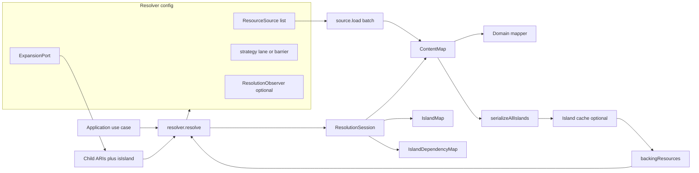
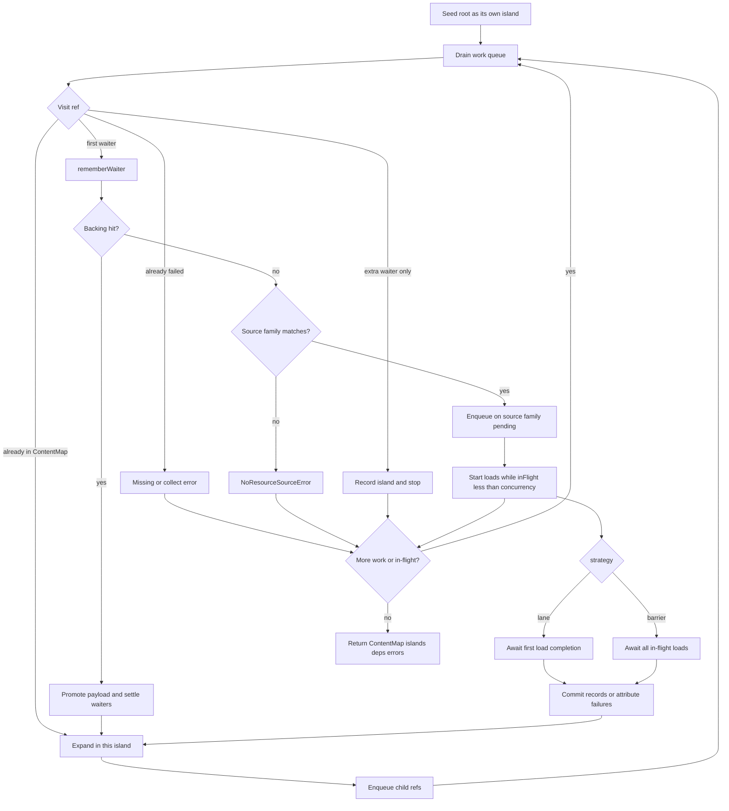
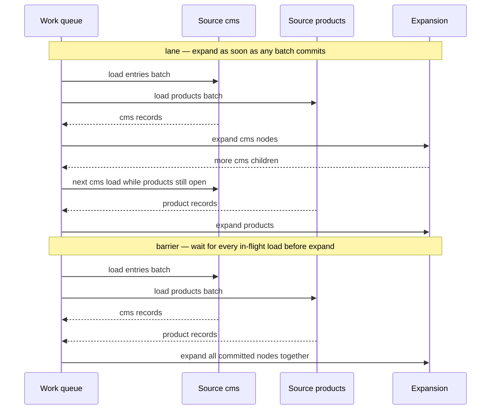
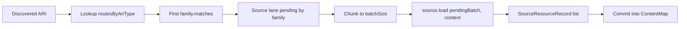
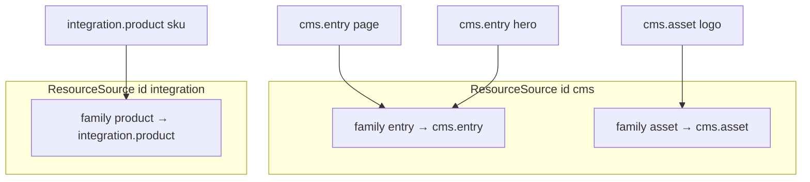
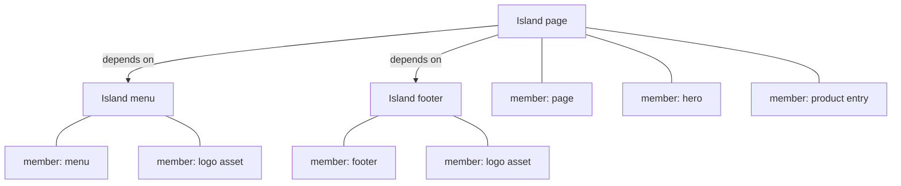
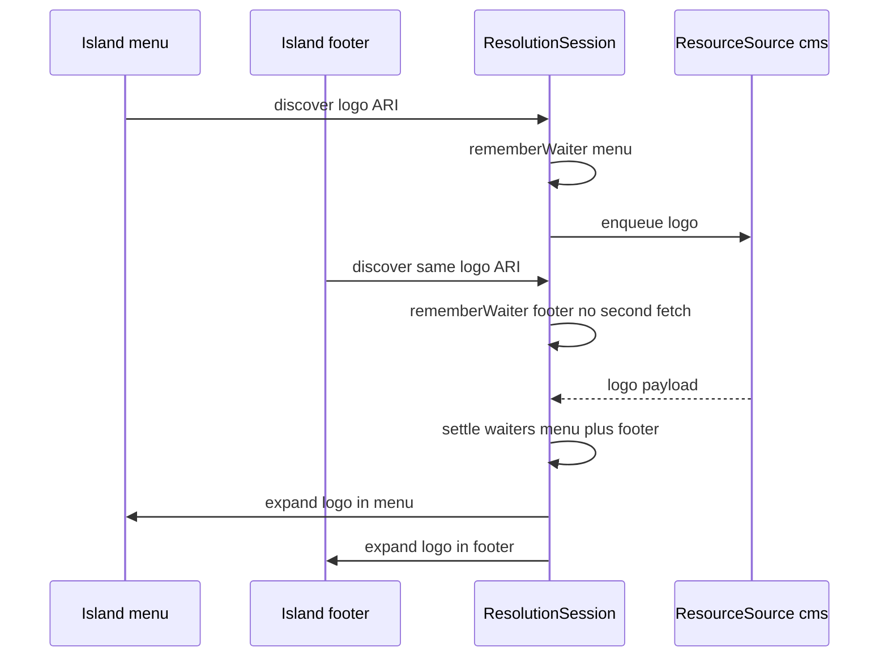
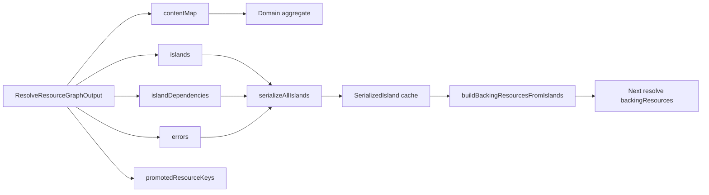

# Architecture

Visual overview of `@xndrjs/resource-graph-resolver`: how pieces fit together, how a resolve walk runs, how `lane` and `barrier` differ, and how islands track shared resources.

Narrative guide: [Resource graph resolver](https://www.xndrjs.dev/v0/infrastructure/resource-graph-resolver/) on the docs site.

## Component wiring

You declare **sources** (one per backend) and an **expansion** port. The resolver owns routing, chunking, concurrency, scheduling, and island bookkeeping. Application code maps the resulting `ContentMap` into domain aggregates and may serialize islands for cache.

## Ownership split

| Owner              | Responsibility                                                                                                                                 |
| ------------------ | ---------------------------------------------------------------------------------------------------------------------------------------------- |
| **Resolver**       | Route by ARI `type` + family `matches`, chunk to `batchSize`, throttle to `concurrency`, schedule loads, dedupe fetches, expand, track islands |
| **ResourceSource** | Declare owned families, fetch one narrowed batch, retry/backoff inside `load`                                                                  |
| **ExpansionPort**  | Discover children from **current resource + payload + execution context** only                                                                 |
| **Application**    | ARIs, registry, orchestration, domain mapping, cache TTL/invalidation                                                                          |

## Resolve loop

Each walk step is a `GraphWalkRef` (ARI + island context). The work queue is drained non-recursively. Already-resolved ARIs expand immediately; backing hits promote without IO; otherwise the ARI is routed onto a source lane and loaded in batches.

## Lane vs barrier

Both strategies produce the **same** graph output. They differ only in when expansion runs relative to in-flight loads.

Prefer **lane** when backend latencies diverge (CMS vs commercial API). Prefer **barrier** for reproducible rounds in traces and tests.

## Source routing and batches

Routing is by ARI `type`, then the first family whose `matches` accepts the ARI. The resolver builds a narrowed batch per family and caps each family to `batchSize`. A source may run up to `concurrency` loads in parallel.

Example topology (demo-shaped):

## Islands: membership vs dependencies

An island is a walk subgraph with its own identity. Expansion returning `isIsland: true` opens a new island; the parent records a **dependency** edge. Resources discovered while expanding under that island are **members**, not separate islands.

Membership and dependency are separate: the page island may depend on `menu` without containing menu payloads. `getFlatDependencies(page)` returns the transitive island closure for cache manifests.

Islands are for **macro-grouping** (lifecycle / reuse boundaries). Fine-grained islands over a shared subgraph multiply membership entries.

## Shared resources and waiters

A resource reachable from several islands is **fetched once**. The session keeps a waiter set of island ids; after commit, expansion runs once per waiting island so membership is recorded in all of them.

Backing promotion follows the same waiter rule: a hit is expanded for every island that was waiting, and the caller's `backingResources` map is never mutated (`promotedResourceKeys` reports what the walk used).

## Output and downstream

## Error model

| Situation                            | `throw`                     | `collect`                                     |
| ------------------------------------ | --------------------------- | --------------------------------------------- |
| Source omitted a requested ARI       | `MissingResourceError`      | Error entry per waiting islands               |
| No source declares a matching family | `NoResourceSourceError`     | Error entry (wiring bug)                      |
| `load` rejected                      | `ResourceLoadFailedError`   | Errors for that batch; other sources continue |
| Abort signal                         | `ResourceGraphAbortedError` | Always throws                                 |

All extend `ResourceGraphError`. Observer hooks never affect the walk: a throwing observer is swallowed.
